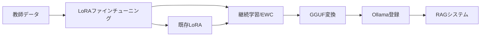

# MoE-RAG: AI Fine-tuning Toolkit with RAG Integration & Continual Learning

🚀 **日本語LLMファインチューニング + RAGシステム + 継続学習統合Webツールキット**

Dockerベースの統合Webインターフェースで、日本語大規模言語モデル（LLM）のファインチューニング、土木道路設計特化型RAGシステム、そしてEWCベースの継続学習を同一プラットフォームで実行できます。単一のポート（8050）で全機能にアクセス可能な革新的なツールキットです。

## 📢 最新の更新 (2025年10月1日)

### 🎉 GitHub MCP統合と開発環境強化
- **✅ GitHub MCP統合**: `.mcp.json`にGitHub MCPサーバーを設定完了
- **✅ リポジトリ管理強化**: GitHub APIを使用したIssue/PR管理が可能に
- **✅ コード検索機能**: GitHub全体の高速コード検索をサポート
- **✅ 開発者体験向上**: MCP経由でのGitHub連携により開発効率が向上
- **✅ 継続学習システム完全稼働**: EWCベースの継続学習が安定稼働中

### 🎉 最新実装機能 (2025年9月18日)
- **継続学習の完全動作確認**: DeepSeek-R1-Distill-Qwen-32BのLoRAファインチューニング済みモデルで継続学習が正常稼働
- **量子化モデルのGGUF変換対応**: 4bit量子化でのLoRA学習後もGGUF変換・Ollama登録が正常動作
- **メモリアロケータエラー解決**: 32Bモデルの継続学習時のCUDAメモリエラーを修正
- **RAGシステム完全統合**: ファインチューニング済みモデル・継続学習モデルでのベクトル/キーワード検索が正常稼働

### 🔧 以前の更新 (2025年9月9日)
- **継続学習の完全サポート**: LoRAファインチューニング済みモデルに対する継続学習機能を完全実装
- **メモリ最適化**: 32Bモデルの継続学習でOOMエラーを解決、GPU選択ロジックを改善
- **EWC改善**: Fisher行列計算のエラーハンドリングを強化、既存LoRA使用時の自動調整
- **DeepSeek-R1-Distill-Qwen-32B GGUF統合**: 19GBの量子化モデル（Q4_K_M）をOllamaに登録、RAGシステムで利用可能
- **LoRA→MoE変換アダプター**: 複数のLoRAアダプタをMixture of Expertsアーキテクチャに統合する機能を実装
- **完全学習パイプライン**: 教師データ作成→LoRA→継続学習→GGUF→RAGの一貫したワークフロー
- **動的モデル選択**: RAGシステムでリアルタイムにモデルを切り替え可能（再起動不要）
- **回答文字数制御**: RAGシステムの最大トークン数を設定ファイルで調整可能（最大4096トークン）

### 🚀 DeepSeek-32B統合パイプライン（継続学習対応）


### ✅ 全システム正常稼働確認済み (2025/9/25検証)
- **継続学習システム**: EWC継続学習が完全動作、Fisher情報行列の計算・保存・適用が正常 ✅
- **LoRAファインチューニング**: DeepSeek-R1-Distill-Qwen-32Bモデルで正常動作、4bit量子化対応 ✅
- **GGUF変換**: LoRAアダプタからGGUF形式への変換・Ollama登録が正常動作 ✅
- **RAGシステム**: ファインチューニング済み・継続学習モデルでのハイブリッド検索（ベクトル+キーワード）が正常稼働 ✅
- **文書アップロード**: PDFアップロードによるベクトルDB構築・検索機能が正常動作 ✅
- **メモリ管理**: 32Bモデルの量子化最適化、CUDAアロケータエラー解決済み ✅
- **タスク履歴管理**: `data/continual_learning/tasks_state.json`による永続的な状態管理 ✅

## 🧑‍💻 開発者向けガイド（ビルド・テスト・開発）

### リポジトリ構成（概要）
```
MoE_RAG/
- app/                      # FastAPIアプリ（`app/main_unified.py`）とUI資産
- src/
  - rag/                    # クエリエンジン・インデックス・検索
  - training/               # LoRA/DoRA、継続学習
  - moe_rag_integration/    # MoEとRAGの統合
  - inference/              # 推論（vLLM/AWQなど）
  - utils/                  # 共通ユーティリティ
- scripts/                  # 起動/モデル準備/変換などのユーティリティ
- tests/                    # 単体・統合テスト（`test_*.py`）
- docker/                   # Dockerfile と docker-compose（フルスタック）
- config/, configs/         # ランタイム・学習用の設定
- data/, models/, outputs/, templates/  # データ、モデル、成果物、テンプレート
```

### 開発環境セットアップ（ローカル）
- Python 3.8以上を推奨（pyproject準拠）。
- 任意の仮想環境を用意して下記のいずれかで依存を導入:
  - `python -m venv venv && source venv/bin/activate && pip install -e .[dev]`
  - または `pip install -r requirements.txt`

### Lint / Format
- `black . && isort . && flake8 src tests`
  - Black 行長: 88、isort プロファイル: "black"（`pyproject.toml`に定義）

### テスト実行
- すべてのユニットテスト: `pytest -q`
- 重い/外部依存のテストを除外: `pytest -m "not integration" -q`
- 一部テストは `@pytest.mark.integration` でマークされています。

### API のローカル起動（開発）
- `python -m uvicorn app.main_unified:app --host 0.0.0.0 --port 8050 --reload`

### Docker スタック（本番相当）
- 初回ビルドと起動: `cd docker && docker-compose up -d --build`
- Web/UI サービス開始: `bash scripts/start_web_interface.sh`

### コーディング規約
- フォーマッタ: Black（行長 88）/ isort（profile "black"）。
- スタイル: インデント4スペース、UTF-8、関数は小さく凝集。
- 命名: モジュール/関数/変数は `snake_case`、クラスは `CapWords`、定数は `UPPER_SNAKE`。
- 公開APIの安定性: `src/rag/` と `app/` の公開インターフェースは互換性を重視。新規モジュールには docstring を付与。

### テスト指針
- テストランナー: pytest（unittest 併用箇所あり）。
- 位置: `tests/` 配下に `test_*.py`。長時間/インフラ依存は `@pytest.mark.integration`。
- PR前チェック例: `pytest -q && flake8 && black --check . && isort --check-only .`。

### コミット / PR ガイドライン
- Conventional Commits を使用: `feat: ...`, `fix: ...`, `docs: ...`, `chore: ...`。
- PR には目的/スコープ、テスト計画・結果、UI/API のログやスクショ、関連Issue、設定変更の移行メモを含めてください。
- 大きな成果物はコミットしない（`data/`, `models/`, `outputs/` はサンプル最小限のみ）。

### セキュリティ / 設定
- 機密は `.env` 経由（例は `.env.example`）。鍵やトークンはコミット禁止。
- 設定は `config/` および `src/rag/config/` に配置。デフォルト/上書きの関係を文書化。
- スクリプトや `docker/` が参照する GPU/Docker のパスは名称変更に注意（変更時は両者を更新）。

### 開発メモ（メンテナ向け）
- 変更は最小・焦点化して適用し、Black/isort を遵守。
- `src/rag/` や `app/` の公開エンドポイント互換性を壊す変更は、ドキュメント/テストも同時更新。
- コード検索は `rg` を推奨。ユーザー向け挙動が変わる場合は README を更新。

## 🌟 主要機能

### 🌐 統合Webインターフェース（RAG + 継続学習統合済み）
- **単一ポートアクセス**: http://localhost:8050 で全機能利用可能
- **ファインチューニング機能**: http://localhost:8050/finetune ✅ 正常稼働
- **RAG機能**: http://localhost:8050/rag ✅ 正常稼働
- **継続学習機能**: http://localhost:8050/continual ✅ 正常稼働
- **リアルタイム監視**: ファインチューニング進捗の可視化
- **モデル管理**: 学習済みモデルの一覧・選択・生成
- **データアップロード**: JSONLファイル + PDF文書の簡単アップロード
- **システム情報**: GPU使用状況とメモリ監視
- **プロフェッショナルデザイン**: 株）テイコクロゴと洗練されたUI
- **Ollama統合**: Ollamaモデル（Llama 3.2 3B）による高速推論 ✅ 動作確認済み

### 🏗️ 土木道路設計特化型RAGシステム（NEW: 統合済み）
- **統合API**: `/rag/*` エンドポイントで9つのRAG機能を提供
- **モデル選択UI**: ファインチューニング済みモデルをRAGで使用可能（NEW）
- **ハイブリッド検索**: ベクトル検索 + キーワード検索の統合
- **多層リランキング**: Cross-encoder、技術用語、文脈理解による精度向上
- **引用機能**: 正確な出典情報付き回答生成
- **数値処理**: 設計速度・曲線半径・勾配等の自動抽出・検証
- **バージョン管理**: 文書の差分検出・変更履歴追跡
- **設計基準チェック**: 道路構造令準拠の適合性検証
- **ストリーミング応答**: リアルタイム検索結果表示
- **バッチ処理**: 複数クエリの一括処理
- **メタデータ管理**: 文書分類・検索・統計機能
- **レスポンシブUI**: 改善されたレイアウトと視認性（NEW）

#### 🎯 技術用語ブーストとは

技術用語ブーストは、道路設計の専門用語が含まれる文書に対して追加のスコアボーナスを与える仕組みです。

##### 計算方法

1. **基本のハイブリッドスコア**
   ```
   hybrid_score = vector_score × 0.7 + keyword_score × 0.3
   ```

2. **技術用語ブーストの適用**（`src/rag/retrieval/hybrid_search.py` 行423-424）
   ```python
   tech_boost = self._calculate_technical_boost(result.text, keywords)
   boosted_hybrid_score = hybrid_score * (1.0 + tech_boost)
   ```

3. **ブースト率の計算**（行470-480）
   - 文書内でクエリのキーワードがどれだけマッチしたかを計算
   - マッチ率に基づいて**最大20%**のブースト
   - 例：キーワードの50%がマッチ → 10%ブースト
   - 例：キーワードの100%がマッチ → 20%ブースト

##### 技術用語の定義

システムは以下を技術用語として認識します（行73-86）：

1. **数値と単位**: 80km/h、100m、5% など
2. **設計基準値**: 最小曲線半径、最大勾配 など
3. **道路部位**: 車道、歩道、中央分離帯 など
4. **専門用語**: 設計速度、曲線半径、縦断勾配 など
5. **規格参照**: 道路構造令、JIS規格 など

##### 重要キーワードの重み（行89-107）

特に重要な専門用語には高い重みが設定されています：
- **設計、基準**: 2.0倍
- **安全、規定**: 1.8倍
- **構造、幅員、勾配**: 1.5倍

##### 実例

検索結果の例：
```
結果 1:
  Vector Score: 0.8589
  Keyword Score: 0.8632
  Hybrid Score: 1.0322
  期待値 (0.7*v + 0.3*k): 0.8602
  技術用語ブースト: 20%
```

- 基本スコア：0.8589 × 0.7 + 0.8632 × 0.3 = 0.8602
- ブースト適用：0.8602 × 1.20 = 1.0322

この仕組みにより、道路設計の専門的な内容を含む文書が優先的に上位にランクされ、より関連性の高い検索結果が得られます。

### 🎯 DPO (Direct Preference Optimization) 学習システム（NEW）
- **人間のフィードバックから直接学習**: RLHFの代替手法として効率的な学習を実現
- **Preference データ収集**: UIから (prompt, chosen, rejected) 形式のデータを収集
- **統合学習パイプライン**: データ収集からDPO学習まで単一ページで完結
- **リアルタイム進捗監視**: 学習状況を3秒ごとに更新して表示
- **LoRA + DPO統合**: メモリ効率的なDPO学習をサポート
- **ハイパーパラメータ調整**: Beta値、学習率、LoRA設定などをUIから制御可能

#### 📚 DPO学習の詳細仕様

##### 1. DPO（Direct Preference Optimization）とは
DPOは、強化学習（RLHF）を使わずに人間のフィードバックからモデルを直接学習させる手法です。

**主な利点**:
- **シンプル**: 報酬モデルや強化学習が不要
- **安定**: PPOなどの不安定な学習アルゴリズムを使用しない
- **効率的**: メモリ効率的でLoRAと組み合わせ可能

##### 2. データ形式
DPO学習には、以下の形式のPreferenceデータが必要です：

```json
{
  "prompt": "設計速度80km/hの道路の最小曲線半径は？",
  "chosen": "設計速度80km/hの場合、最小曲線半径は280mです。道路構造令第15条に基づきます。",
  "rejected": "だいたい200mくらいです。",
  "margin": 2.0
}
```

- **prompt**: モデルへの入力質問
- **chosen**: 好ましい（正しい）回答
- **rejected**: 好ましくない（不適切な）回答
- **margin**: 選好の強さ（オプション、デフォルト1.0）

##### 3. データ収集方法

**方法1: Web UIでの手動収集** (推奨)
1. http://localhost:8050/dpo にアクセス
2. プロンプト、好ましい回答、好ましくない回答を入力
3. 「Preferenceを追加」ボタンでデータ保存
4. `data/dpo/preference_dataset.jsonl` に自動保存

**方法2: JSONLファイルアップロード**
1. ローカルでJSONLファイルを作成
2. Web UIの「ファイルからアップロード」でアップロード
3. 既存データに追加される

**方法3: API経由**
```bash
curl -X POST "http://localhost:8050/api/dpo/add-preference" \
  -H "Content-Type: application/json" \
  -d '{
    "prompt": "質問",
    "chosen": "良い回答",
    "rejected": "悪い回答"
  }'
```

##### 4. DPO学習の実行

**UIからの実行** (推奨)
1. http://localhost:8050/dpo の「🚀 DPO学習を実行」セクション
2. ベースモデル選択（例: DeepSeek-R1-Distill-Qwen-32B-Japanese）
3. ハイパーパラメータ設定:
   - LoRA Rank (r): 64 推奨
   - LoRA Alpha: 128 推奨（2×r）
   - DPO Beta: 0.1 推奨（低い→積極的、高い→保守的）
   - 学習率: 5e-6 推奨
   - エポック数: 1-3
4. 「DPO学習を開始」をクリック
5. リアルタイムで進捗を監視

**API経由での実行**
```bash
curl -X POST "http://localhost:8050/api/train" \
  -H "Content-Type: application/json" \
  -d '{
    "model_name": "cyberagent/DeepSeek-R1-Distill-Qwen-32B-Japanese",
    "training_method": "dpo",
    "training_data": ["data/dpo/preference_dataset.jsonl"],
    "lora_config": {
      "r": 64,
      "lora_alpha": 128,
      "dropout": 0.05
    },
    "training_config": {
      "beta": 0.1,
      "num_epochs": 1,
      "learning_rate": 5e-6,
      "max_prompt_length": 1024,
      "max_length": 2048
    }
  }'
```

##### 5. ハイパーパラメータの意味

| パラメータ | 推奨値 | 説明 |
|----------|--------|------|
| **LoRA r** | 64 | LoRAのランク（高いほど表現力↑、メモリ↑） |
| **LoRA Alpha** | 128 | スケーリング係数（通常2×r） |
| **DPO Beta** | 0.1 | 選好の強さ（低い→積極的、高い→保守的） |
| **学習率** | 5e-6 | 学習の速度（大きいほど速いが不安定） |
| **エポック数** | 1 | データセット全体を学習する回数 |
| **Max Length** | 2048 | 最大トークン長（長いほどメモリ使用↑） |

##### 6. 学習済みモデルの利用
- 保存先: `outputs/dpo_adapter/`
- RAGシステムで選択可能
- 継続学習のベースモデルとして使用可能
- Ollama形式に変換してRAGで利用可能

### 🔄 継続学習システム（NEW）
- **EWCベース継続学習**: Fisher情報行列による重要パラメータの保護
- **破滅的忘却の防止**: 以前のタスクの知識を保持しながら新タスクを学習
- **タスク管理**: 複数の学習タスクの実行状況をリアルタイム監視
- **学習履歴管理**: 完了したタスクの履歴と成果物の管理
- **メモリ効率化**: 効率的なFisher行列管理による省メモリ実行
- **モデル選択**: ベースモデルやファインチューニング済みモデルから選択可能

#### 📚 継続学習の詳細仕様

##### 1. システムアーキテクチャ
継続学習システムは、**EWC（Elastic Weight Consolidation）** アルゴリズムを使用して、破滅的忘却を防ぎながら新しいタスクを学習します。

**主要コンポーネント**:
- **Fisher情報行列**: 各タスクで学習したパラメータの重要度を記録
- **EWCペナルティ**: 重要なパラメータの変更を制限（デフォルト: λ=5000）
- **タスク履歴管理**: `outputs/ewc_data/task_history.json`に全履歴を永続化

##### 2. 動作フロー
```python
# 継続学習パイプライン（src/training/continual_learning_pipeline.py）
1. ベースモデルのロード
   - フルファインチューニング済みモデルから開始
   - outputs/ディレクトリから自動検出

2. 継続学習タスクの実行
   - 過去のFisher行列をロード
   - EWC損失を含むトレーニング実行
   - 新しいFisher行列を計算・保存

3. Fisher行列の効率的管理
   - ブロック単位計算（1Mパラメータごと）
   - メモリ効率的な保存形式
   - 動的バッチサイズによる最適化
```

##### 3. モデル更新ボタンの機能
Webインターフェースの「モデル更新」ボタンは、**利用可能なモデルリストを更新**する機能です：

- `outputs/`ディレクトリをスキャンして新規モデルを検出
- モデル選択ドロップダウンを最新状態に更新
- **注意**: モデル自体の更新ではなく、リストの更新機能

##### 4. 学習済みモデルの保存
**すべての継続学習タスクで作成されたモデルは自動的に保存されます**：

| 保存内容 | ファイル | 説明 |
|---------|----------|------|
| モデルの重み | `pytorch_model.bin` | 学習済みパラメータ |
| 設定ファイル | `config.json` | モデルアーキテクチャ |
| トークナイザー | `tokenizer_config.json` | テキスト処理設定 |
| 学習情報 | `training_info.json` | 学習パラメータ履歴 |
| Fisher行列 | `outputs/ewc_data/fisher_task_*.pt` | EWC用重要度情報 |

##### 5. 継続学習の実行例
```bash
# Webインターフェースから実行
1. http://localhost:8050/continual にアクセス
2. ベースモデルを選択（フルファインチューニング済みモデル推奨）
3. タスク名とデータセットをアップロード
4. EWCパラメータを設定（λ=5000推奨）
5. 「学習開始」をクリック

# 学習履歴の確認
- data/continual_learning/tasks_state.json に全タスクの状態を永続的に記録
- outputs/continual_task_* に各タスクのモデルを保存
- エラー発生時も状態が保存され、再開可能
```

##### 6. 技術的特徴
- **逐次的知識獲得**: 新タスクを学習しながら過去の知識を保持
- **メモリ効率**: 動的バッチサイズと効率的なFisher行列管理
- **完全な追跡可能性**: すべてのタスクとモデルの履歴を保存
- **柔軟な設定**: EWCλ、学習率、エポック数などカスタマイズ可能

### ファインチューニング手法
- **🔥 フルファインチューニング**: 全パラメータ更新による高精度学習
- **⚡ LoRA**: パラメータ効率的学習（低メモリ）
- **🌟 DoRA (NEW)**: Weight-Decomposed LoRA - LoRAを超える精度と効率性
- **💎 QLoRA**: 4bit/8bit量子化による超省メモリ学習
- **🎯 DPO (NEW)**: Direct Preference Optimization - 人間のフィードバックから直接学習
- **🧠 EWC**: 継続的学習による破滅的忘却の抑制
- **🚀 AWQ (NEW)**: 4ビット量子化で75%メモリ削減
- **⚙️ vLLM (NEW)**: PagedAttentionによる高速推論エンジン
- **🔧 自動量子化**: モデルサイズに応じた最適化
- **🎯 MoE (Mixture of Experts)**: 専門エキスパートモデルによる効率的な学習と推論

### ✅ サポートモデル
最新のサポートモデルリストです。継続学習とMoEアーキテクチャに最適化されています。

#### 🌟 推奨モデル
- **DeepSeek-R1-Distill-Qwen-32B** (cyberagent): GGUF対応、Ollama統合済み
- **Llama 3.2 3B** (Meta): 軽量・高速推論、Ollama経由で利用可能

| モデル名 | タイプ | 精度 | 推奨VRAM | タグ |
| :--- | :--- | :--- | :--- | :--- |
| **Qwen/Qwen2.5-14B-Instruct** | CausalLM | bfloat16 | 32GB | `multilingual`, `14b`, `instruct` |
| **Qwen/Qwen2.5-32B-Instruct** | CausalLM | bfloat16 | 80GB | `multilingual`, `32b`, `instruct` |
| **cyberagent/DeepSeek-R1-Distill-Qwen-32B-Japanese** | CausalLM | bfloat16 | 80GB | `japanese`, `32b`, `deepseek` |
| **cyberagent/calm3-22b-chat** | CausalLM | float16 | 48GB | `japanese`, `22b`, `chat` |
| **meta-llama/Meta-Llama-3.1-70B-Instruct** | CausalLM | bfloat16 | 160GB | `multilingual`, `70b`, `instruct` |
| **meta-llama/Meta-Llama-3.1-32B-Instruct** | CausalLM | bfloat16 | 80GB | `multilingual`, `32b`, `instruct` |
| **microsoft/Phi-3.5-32B-Instruct** | CausalLM | bfloat16 | 80GB | `multilingual`, `32b`, `instruct` |
| **microsoft/Orca-2-32B-Instruct** | CausalLM | bfloat16 | 80GB | `multilingual`, `32b`, `instruct` |

### GPU最適化
- **Flash Attention 2**: 注意機構の高速化
- **Gradient Checkpointing**: メモリ使用量削減
- **Mixed Precision**: FP16による計算高速化
- **マルチGPU対応**: DataParallel/DistributedDataParallel

### 🎯 MoE (Mixture of Experts) アーキテクチャ（強化版）

#### 概要
MoEシステムは、複数の専門エキスパートモデルを組み合わせて、効率的かつ高精度な推論を実現します。土木・道路設計分野に特化した専門知識を持つエキスパートモデルを構築・管理できます。

#### 主要機能
- **専門エキスパート**: 道路設計（road）、法規（regulations）など分野別エキスパート
- **動的ルーティング**: クエリに応じて最適なエキスパートを自動選択
- **メモリ最適化版実装**: 大規模モデルでも安定稼働（`src/moe/moe_architecture_optimized.py`）
- **永続化機構**: 学習済みMoEモデルの自動保存・復元
- **統合管理**: Web UIからのトレーニング・デプロイ・推論

#### MoE トレーニング実行例
```python
from src.moe.moe_architecture_optimized import OptimizedMoE
from src.moe.moe_training import MoETrainer

# MoEモデルの初期化（メモリ最適化版）
moe = OptimizedMoE(
    base_model_path="cyberagent/calm3-22b-chat",
    num_experts=8,
    experts_per_token=2,
    use_memory_efficient=True  # メモリ最適化有効
)

# トレーニング実行
trainer = MoETrainer(moe)
trainer.train(
    road_data="data/road_design.jsonl",
    regulations_data="data/regulations.jsonl",
    epochs=3
)

# モデルの保存
moe.save_pretrained("outputs/moe_civil")
```

### 🧠 メモリ最適化（継続学習対応強化版）
- **動的量子化**: 32B/22Bモデルは4bit、7B/8bitモデルは8bit量子化を自動選択
- **GPU使用率最適化**: 90-95%の効率的なGPUメモリ割り当て（24GB GPUで20GB使用）
- **マルチGPU自動選択**: 継続学習時に空きメモリが多いGPUを自動選択
- **prepare_model_for_kbit_training最適化**: 継続学習では不要な変換をスキップ
- **CPUオフロード**: GPUメモリ不足時の自動CPU実行
- **メモリ監視**: リアルタイムメモリ使用量の監視と警告
- **モデルキャッシュ**: 効率的なモデル再利用
- **最適化されたAPI**: メモリ効率的なWeb API（`app/main_unified.py`）

## 📂 プロジェクト構造

```
MoE_RAG/
├── app/                    # Webアプリケーション
│   ├── main_unified.py    # 統合FastAPIサーバー（ポート8050）
│   ├── static/            # 静的ファイル（CSS、JS、画像）
│   └── ollama_integration.py  # Ollama統合モジュール
├── src/                    # コアロジック
│   ├── training/          # 学習システム
│   │   ├── lora_finetuning.py        # LoRA実装
│   │   ├── dora/                     # DoRA実装
│   │   └── continual_learning_pipeline.py  # EWC継続学習
│   ├── rag/               # RAGシステム
│   │   ├── core/query_engine.py      # メインRAGエンジン
│   │   ├── indexing/vector_store.py  # Qdrantベクトルストア
│   │   └── retrieval/hybrid_search.py # ハイブリッド検索
│   ├── moe_rag_integration/  # MoE-RAG統合
│   │   └── unified_moe_rag_system.py # 統合システム
│   └── inference/         # 推論システム
│       ├── vllm_integration.py       # vLLM高速推論
│       └── awq_quantization.py       # AWQ量子化
├── docker/                # Docker設定
│   ├── Dockerfile         # メインコンテナ定義
│   └── docker-compose.yml # サービス構成
├── scripts/               # ユーティリティスクリプト
│   ├── start_web_interface.sh       # Web起動スクリプト
│   └── docker_build_rag.sh         # 自動ビルドスクリプト
├── data/                  # データディレクトリ
│   ├── continual_learning/          # 継続学習データ
│   └── rag_documents/               # RAG文書
├── models/                # 事前学習モデル
├── outputs/               # 出力ファイル
│   ├── ewc_data/         # EWC Fisher行列
│   └── moe_civil/        # MoEモデル
├── templates/             # HTMLテンプレート
├── config/                # 設定ファイル
│   ├── ollama_config.json          # Ollama設定
│   └── rag_config.yaml             # RAG設定
├── .serena/memories/      # Serenaプロジェクト知識
├── start_dev_env.sh       # 開発環境起動スクリプト（NEW）
├── stop_dev_env.sh        # 開発環境停止スクリプト（NEW）
└── README.md              # このファイル
```

## 📋 必要環境

### ハードウェア要件
- **GPU**: NVIDIA GPU（CUDA対応）
- **メモリ**: 最低8GB VRAM（推奨16GB以上）
- **システムメモリ**: 16GB以上推奨

### ソフトウェア要件
- Python 3.8以上（推奨3.11）
- CUDA 12.6+
- Docker & Docker Compose
- Git
- Ollama（Ollamaモデル統合のため）

## 🚀 クイックスタート

### 超簡単起動（3コマンドで全環境起動）
```bash
# 1. リポジトリクローン
git clone https://github.com/kji-furuta/MoE_RAG.git
cd MoE_RAG

# 2. Docker環境起動
cd docker && docker-compose up -d --build  # 初回のみ
# 2回目以降は: docker-compose up -d

# 3. Webインターフェース起動
docker exec ai-ft-container bash /workspace/scripts/start_web_interface.sh

# 4. ブラウザでアクセス
# http://localhost:8050/
```

### Ollamaモデル管理

#### モデル削除コマンド
```bash
# 特定モデルの削除
ollama rm 5_deepseek-32b-finetuned:latest

# Docker環境での削除
docker exec ai-ft-container ollama rm 5_deepseek-32b-finetuned:latest

# 複数モデルの一括削除
for i in {0..99}; do
    ollama rm ${i}_deepseek-32b-finetuned:latest 2>/dev/null
done
```

#### 継続学習タスク削除
```bash
# タスク一覧確認
docker exec ai-ft-container python /workspace/scripts/delete_continual_task.py --list

# 特定タスクの削除
docker exec ai-ft-container python /workspace/scripts/delete_continual_task.py --delete task_001

# 削除前の確認（Dry Run）
docker exec ai-ft-container python /workspace/scripts/delete_continual_task.py --delete task_001 --dry-run
```

### 詳細セットアップ手順

#### 1. リポジトリのクローン
```bash
# メインリポジトリ（GitHub）
git clone https://github.com/kji-furuta/MoE_RAG.git
cd MoE_RAG

# または開発用リポジトリ
git clone https://github.com/kji-furuta/AI_FT_7.git
cd AI_FT_7
```

#### 2. Ollamaのインストール（初回のみ）
```bash
# Ollamaをインストール
curl -fsSL https://ollama.com/install.sh | sh

# Ollamaサービスを起動
ollama serve

# Llama 3.2 3Bモデルをダウンロード（自動化済み）
ollama pull llama3.2:3b
```
※ 新しいターミナルウィンドウでOllamaを起動したままにしてください
※ start_dev_env.sh使用時は自動でモデルがダウンロードされます

#### 3. Docker環境の起動（RAG統合版）

##### 自動ビルド（推奨）
```bash
# RAG依存関係も含めた完全ビルド＋起動＋テスト
./scripts/docker_build_rag.sh --no-cache
```

##### 手動ビルド
```bash
# 初回のみ：RAG統合版Dockerイメージビルド
cd docker
docker-compose up -d --build

# 2回目以降：通常起動（ビルド不要）
docker-compose up -d
```

#### 4. 統合Webインターフェースの起動

##### 🚀 本番モード vs 開発モード

**本番モード（推奨：重い処理を実行する場合）**
```bash
# 自動リロード無効・安定動作
docker exec ai-ft-container bash /workspace/scripts/start_web_interface.sh production
```
- ✅ LoRAアダプター適用、量子化処理時に使用
- ✅ ファイル変更による再起動なし
- ✅ 処理中断のリスクなし

**開発モード（コード開発時）**
```bash
# 自動リロード有効
docker exec ai-ft-container bash /workspace/scripts/start_web_interface.sh
```
- ✅ コード変更が即座に反映
- ⚠️ llama.cpp作業時に再起動の可能性

##### 方法2: 手動起動（トラブルシューティング用）
```bash
# 本番モード（リロード無効）
docker exec ai-ft-container python -m uvicorn app.main_unified:app \
  --host 0.0.0.0 --port 8050 --workers 1

# 開発モード（リロード有効）
docker exec ai-ft-container python -m uvicorn app.main_unified:app \
  --host 0.0.0.0 --port 8050 --reload \
  --reload-exclude "**/llama.cpp/**" \
  --reload-exclude "**/outputs/**"
```

##### 方法3: バックグラウンド起動
```bash
# バックグラウンドで起動（本番モード推奨）
docker exec -d ai-ft-container python -m uvicorn app.main_unified:app \
  --host 0.0.0.0 --port 8050 --workers 1
```

##### 方法4: ファイル不足時の対処法
```bash
# 必要なファイルをコンテナにコピー
docker cp app/ ai-ft-container:/workspace/
docker cp templates/ ai-ft-container:/workspace/
docker cp src/ ai-ft-container:/workspace/

# Webサーバーを起動
docker exec -d ai-ft-container python -m uvicorn app.main_unified:app --host 0.0.0.0 --port 8050 --reload
```

#### 5. ブラウザでアクセス
- **統合ダッシュボード**: http://localhost:8050/
- **ファインチューニング**: http://localhost:8050/finetune
- **RAGシステム**: http://localhost:8050/rag
- **モデル管理**: http://localhost:8050/models

### 🎯 統合機能一覧
- **統合ダッシュボード**: システム状況とタスク管理
- **ファインチューニング**: データアップロードと学習実行
- **DPO Preference収集**: 人間のフィードバックデータ収集とDPO学習（NEW）
  - Preferenceデータの収集（prompt, chosen, rejected）
  - データセット管理・統計表示
  - LoRA + DPO統合学習
  - リアルタイム学習進捗監視
- **RAGシステム**: 土木道路設計文書の検索・質問応答
  - 文書アップロード・インデックス化
  - ハイブリッド検索（ベクトル+キーワード）
  - ストリーミング応答
  - バッチクエリ処理
  - 文書統計・メタデータ管理
- **テキスト生成**: 学習済みモデルでの推論
- **モデル管理**: 利用可能モデルと学習済みモデル一覧
- **マニュアル**: `/manual` - 詳細な利用方法
- **システム概要**: `/system-overview` - 技術仕様

## 📚 使用方法

### 🌐 Webインターフェース操作マニュアル

ブラウザで `http://localhost:8050` にアクセスして以下の機能を利用：

#### 🏠 **メインダッシュボード** (`/`)
- **システム状況確認**: GPU使用状況、メモリ使用率、RAGシステム状態
- **機能ナビゲーション**: 各機能へのクイックアクセス
- **リアルタイム監視**: システムリソースの可視化

#### 🎯 **ファインチューニング** (`/finetune`)
1. **データアップロード**
   - 「ファイルを選択」ボタンをクリック
   - JSONL形式のトレーニングデータを選択
   - アップロード完了を確認

2. **モデル選択**
   - 利用可能なベースモデルから選択
   - モデルサイズとVRAM要件を確認
   - 推奨モデル: `cyberagent/calm3-22b-chat`

3. **学習設定**
   - **学習手法選択**:
     - `LoRA`: 軽量学習（推奨）
     - `QLoRA`: 4bit量子化学習
     - `フルファインチューニング`: 全パラメータ更新
   - **ハイパーパラメータ調整**:
     - 学習率: 1e-4 ~ 3e-4
     - バッチサイズ: 1-4（VRAMに応じて）
     - エポック数: 1-3

4. **学習実行**
   - 「学習開始」ボタンをクリック
   - リアルタイム進捗バーで監視
   - ログで詳細状況を確認

5. **学習完了**
   - モデル保存場所を確認
   - 生成テストで品質評価
   - モデル管理ページで一覧表示

#### 🎯 **DPO Preference収集** (`/dpo`) - NEW
1. **Preferenceデータ収集**
   - プロンプト（質問）を入力
   - 好ましい回答（Chosen）を入力
   - 好ましくない回答（Rejected）を入力
   - 「Preferenceを追加」で保存

2. **データセット管理**
   - 収集済みデータの一覧表示
   - データ統計情報の確認
   - JSONLファイルでのアップロード

3. **DPO学習実行**
   - ベースモデル選択
   - ハイパーパラメータ設定（LoRA r/alpha, DPO beta）
   - 「DPO学習を開始」ボタンでトレーニング開始
   - リアルタイム進捗監視（3秒ごと更新）

#### 🤖 **テキスト生成** (`/generate`)
1. **モデル選択**
   - 学習済みモデル一覧から選択
   - モデル情報（サイズ、学習日時）を確認

2. **プロンプト入力**
   - テキストエリアに質問・指示を入力
   - 日本語での自然な入力が可能

3. **生成パラメータ調整**
   - **温度 (Temperature)**: 0.1-1.0（創造性の調整）
   - **最大長 (Max Length)**: 100-2048（出力長の制限）
   - **Top-p**: 0.1-1.0（多様性の調整）

4. **生成実行**
   - 「生成開始」ボタンをクリック
   - ストリーミング表示でリアルタイム確認
   - 結果のコピー・保存が可能

#### 🔍 **RAGシステム** (`/rag`) - 土木道路設計特化
1. **文書アップロード**
   - 「ファイルを選択」でPDF文書をアップロード
   - 文書タイトル、カテゴリ、タイプを設定
   - 自動インデックス化の進行状況を確認

2. **インテリジェント検索**
   - **検索タイプ選択**:
     - `Hybrid`: ベクトル+キーワード検索（推奨）
     - `Vector`: 意味的類似性検索
     - `Keyword`: キーワードマッチング
   - **検索クエリ入力**: 自然言語での質問
   - **結果数調整**: top_k（1-20件）

3. **質問応答**
   - 専門的な質問を自然言語で入力
   - 例: 「設計速度80km/hの道路の最小曲線半径は？」
   - 引用情報付きの正確な回答を取得

4. **数値処理・検証**
   - 自動数値抽出: 速度、長さ、勾配など
   - 設計基準チェック: 道路構造令との適合性
   - 単位変換: km↔m、km/h↔m/s

5. **バッチ処理**
   - 複数クエリの一括処理
   - CSVファイルでの一括質問
   - 結果の一括ダウンロード

6. **メタデータ管理**
   - 文書一覧表示
   - カテゴリ別フィルタリング
   - 統計情報の確認

#### 📊 **モデル管理** (`/models`)
1. **利用可能モデル**
   - ベースモデル一覧表示
   - モデル詳細情報（サイズ、VRAM要件）
   - ダウンロード状況の確認

2. **学習済みモデル**
   - ファインチューニング済みモデル一覧
   - 学習日時、手法、サイズ情報
   - モデル削除・アーカイブ機能

3. **モデル変換**
   - Ollama形式への変換
   - GGUF形式への変換
   - 変換進捗の監視

#### ⚙️ **システム管理**
1. **システム情報** (`/api/system-info`)
   - GPU使用状況のリアルタイム監視
   - メモリ使用率の確認
   - RAGシステムの状態確認

2. **キャッシュ管理**
   - モデルキャッシュのクリア
   - メモリ最適化の実行
   - システムリセット

3. **ログ確認**
   - リアルタイムログ表示
   - エラーログの確認
   - システム診断

#### 📖 **ドキュメント**
1. **利用マニュアル** (`/manual`)
   - 詳細な操作手順
   - トラブルシューティング
   - よくある質問

2. **システム概要** (`/system-overview`)
   - 技術仕様の詳細
   - アーキテクチャ説明
   - パフォーマンス情報

## 🏗️ 土木道路設計特化型RAGシステム

### 📖 概要

AI_FT_3には、土木道路設計分野に特化したRAG（Retrieval-Augmented Generation）システムが統合されています。このシステムは、道路構造令や設計基準書などの技術文書から正確な情報を検索し、引用情報付きの回答を生成します。

### 🎯 主要機能

#### 1. 数値処理エンジン
```python
from src.rag.specialized import NumericalProcessor, extract_numerical_values

# テキストから数値を自動抽出
text = "設計速度60km/h、最小曲線半径150m、縦断勾配5%とする。"
processor = NumericalProcessor()
result = processor.process_text(text)

print(f"抽出された数値: {len(result['numerical_values'])}個")
for value in result['numerical_values']:
    print(f"- {value['value']}{value['unit']} ({value['value_type']})")
```

#### 2. 設計基準検証
```python
from src.rag.specialized import check_design_standard

# 道路構造令に基づく適合性チェック
result = check_design_standard(
    value=135,  # 曲線半径135m
    value_type='curve_radius',
    unit='m',
    context={'design_speed': 60}
)

print(f"妥当性: {'○' if result.is_valid else '×'}")
print(f"メッセージ: {result.message}")
```

#### 3. LoRAアダプターのGGUF/Ollama変換（改善版）
```bash
# 改善版スクリプトの使用（サーバー再起動を防ぐ）
docker exec ai-ft-container python /workspace/scripts/apply_lora_to_gguf_improved.py \
  --output-name "my-finetuned-model"

# 旧版スクリプト（互換性のため残存）
docker exec ai-ft-container python /workspace/scripts/apply_lora_to_gguf.py
```

**特徴:**
- `/tmp`ディレクトリでの作業により、ファイル監視による再起動を防止
- 自動クリーンアップ機能
- 既存のビルド済みllama.cppの再利用
- メタデータからベースモデルを自動検索

#### 4. バージョン管理
```python
from src.rag.specialized import create_version_manager

# 文書のバージョン管理
manager = create_version_manager()

# 新しいバージョンを作成
version = manager.create_version(
    document_id="road_standard_001",
    title="道路設計基準書 v1.1",
    content="設計速度は原則として60km/hとする...",
    parent_version_id="previous_version_id"
)

# バージョン間の差分を検出
diff = manager.compare_versions(version1_id, version2_id, content1, content2)
print(f"変更されたセクション: {len(diff.modified_sections)}個")
```

#### 4. ハイブリッド検索エンジン
```python
from src.rag.retrieval import HybridSearchEngine
from src.rag.indexing import QdrantVectorStore, EmbeddingModelFactory

# ハイブリッド検索の設定
vector_store = QdrantVectorStore(collection_name="road_documents")
embedding_model = EmbeddingModelFactory.create("multilingual-e5-large")

search_engine = HybridSearchEngine(
    vector_store=vector_store,
    embedding_model=embedding_model,
    vector_weight=0.7,
    keyword_weight=0.3
)

# 検索実行
from src.rag.retrieval import SearchQuery
query = SearchQuery(text="設計速度60km/hの最小曲線半径は？")
results = search_engine.search(query, top_k=5)
```

#### 5. 統合Web API インターフェース（NEW）
```python
# 統合APIサーバーの起動（RAG + ファインチューニング）
from app.main_unified import app
import uvicorn

# 単一ポート8050で全機能利用可能
uvicorn.run(app, host="0.0.0.0", port=8050)
```

```bash
# 統合REST API の利用例
# RAGクエリ（統合API）
curl -X POST "http://localhost:8050/rag/query" \
     -H "Content-Type: application/json" \
     -d '{
       "query": "設計速度80km/hの道路の最小曲線半径を教えて",
       "top_k": 5,
       "search_type": "hybrid"
     }'

# RAGヘルスチェック
curl "http://localhost:8050/rag/health"

# RAG文書アップロード
curl -X POST "http://localhost:8050/rag/upload-document" \
     -F "file=@道路設計基準.pdf" \
     -F "title=道路設計基準書" \
     -F "category=設計基準"

# RAG簡易検索
curl "http://localhost:8050/rag/search?q=曲線半径&top_k=3"

# RAG文書一覧
curl "http://localhost:8050/rag/documents"

# RAGストリーミング検索
curl -X POST "http://localhost:8050/rag/stream-query" \
     -H "Content-Type: application/json" \
     -d '{"query": "道路設計について教えて", "top_k": 5}'
```

### 📊 統合API エンドポイント一覧

#### ファインチューニング API
- `POST /api/train` - モデルファインチューニング開始
- `GET /api/training-status/{task_id}` - 学習状況確認
- `POST /api/generate` - テキスト生成
- `GET /api/models` - 利用可能モデル一覧

#### MoE (Mixture of Experts) API（NEW）
- `POST /api/moe/train` - MoEモデルのトレーニング開始
- `GET /api/moe/status/{task_id}` - MoEトレーニング状況確認
- `POST /api/moe/deploy` - 学習済みMoEモデルのデプロイ
- `GET /api/moe/deployed` - デプロイ済みMoEモデル情報取得
- `POST /api/moe/inference` - MoEモデルによる推論実行

#### RAG API（MoE統合対応）
- `GET /rag/health` - RAGシステムヘルスチェック
- `POST /rag/query` - 高度な文書検索・質問応答（MoEモデル対応）
- `GET /rag/search` - 簡易検索API
- `POST /rag/batch-query` - バッチクエリ処理
- `GET /rag/documents` - 文書一覧取得
- `POST /rag/upload-document` - 文書アップロード
- `GET /rag/statistics` - システム統計情報
- `POST /rag/stream-query` - ストリーミング検索
- `GET /rag/system-info` - RAGシステム詳細情報
- `POST /rag/moe-query` - MoEエキスパートを使用した専門的クエリ

### 🧪 テスト・検証

統合システムの動作確認用テストスクリプトが用意されています：

#### 統合テスト
```bash
# Webインターフェース統合テスト（100%成功確認済み）
python3 test_integration.py

# Docker RAG統合テスト
python3 test_docker_rag.py

# MoE永続化テスト
python3 scripts/test_moe_persistence.py

# MoE-RAG統合テスト
python3 scripts/test_moe_rag_integration.py

# 継続学習メモリ最適化テスト
python3 scripts/test_continual_memory_optimized.py

# 設定解決機能テスト
python3 scripts/test_config_resolution.py
```

```bash
# 特化機能の簡易テスト
python3 scripts/simple_feature_test.py

# 包括的な機能テスト（依存関係が必要）
python3 scripts/test_specialized_features.py
```

**テスト内容:**
- ✅ 数値抽出: 速度・長さ・勾配の自動認識
- ✅ 単位変換: km↔m、km/h↔m/s、°↔rad
- ✅ 設計基準: 道路構造令との適合性チェック
- ✅ バージョン管理: 差分検出・履歴管理

### 📊 サポートする数値・単位

| 種類 | 単位 | 例 | 検出パターン |
|:---|:---|:---|:---|
| **速度** | km/h, m/s | 60km/h, 16.7m/s | 設計速度、制限速度 |
| **長さ** | m, km, mm, cm | 150m, 2.5km | 曲線半径、幅員、延長 |
| **勾配** | %, % | 5%, 8% | 縦断勾配、横断勾配 |
| **角度** | 度, °, rad | 30度, 0.52rad | 交角、偏角 |
| **面積** | m², km² | 25m², 1.5km² | 断面積、用地面積 |
| **荷重** | kN, t | 245kN, 25t | 軸重、輪荷重 |

### 🏛️ 道路構造令対応

システムは道路構造令の以下の基準に対応しています：

| 項目 | 第1種 | 第2種 | 第3種 | 第4種 |
|:---|:---:|:---:|:---:|:---:|
| **設計速度** | 60-120 km/h | 50-80 km/h | 40-80 km/h | 20-60 km/h |
| **車道幅員** | 3.5m | 3.25m | 3.0m | 2.75m |
| **最大縦断勾配** | 3-5% | 4-6% | 5-7% | 6-8% |

### 🔧 API使用（上級者向け）

### LoRAファインチューニングの例
```python
from src.models.japanese_model import JapaneseModel
from src.training.lora_finetuning import LoRAFinetuningTrainer, LoRAConfig
from src.training.training_utils import TrainingConfig

# モデルの初期化 (新しい推奨モデル)
model = JapaneseModel(
    model_name="cyberagent/calm3-22b-chat"  # または "cyberagent/DeepSeek-R1-Distill-Qwen-32B-Japanese"
)

# LoRA設定
lora_config = LoRAConfig(
    r=16,
    lora_alpha=32,
    target_modules=["q_proj", "v_proj", "k_proj", "o_proj"],
    lora_dropout=0.05,
    use_qlora=False
)

# トレーニング設定
training_config = TrainingConfig(
    learning_rate=3e-4,
    batch_size=4,
    num_epochs=3,
    output_dir="./outputs/lora_stablelm_3b"
)

# トレーナーの初期化と実行
trainer = LoRAFinetuningTrainer(model, lora_config, training_config)
trainer.train(train_texts=["日本の首都は東京です。", "日本の最高峰は富士山です。"])
```

### 🌟 DoRA (Weight-Decomposed Low-Rank Adaptation) の使用例
DoRAは、LoRAを超える精度と効率性を実現する最新のファインチューニング手法です。

```python
from src.training.dora.dora_implementation import DoRAConfig, train_with_dora

# DoRA設定（LoRAより高精度）
config = DoRAConfig(
    rank=32,                     # LoRAより高いランクでも効率的
    alpha=64,                    # スケーリング係数
    dropout=0.1,                 # ドロップアウト率
    use_magnitude_scaling=True   # 大きさスケーリング有効化
)

# DoRAでファインチューニング
model = train_with_dora(
    base_model_path="cyberagent/calm3-22b-chat",
    train_data="data/training_data.jsonl",
    output_dir="outputs/dora_model",
    config=config
)
```

### 🚀 vLLM統合による高速推論
vLLMは、PagedAttentionを使用してメモリ効率とスループットを大幅に向上させます。

```python
from src.inference.vllm_integration import VLLMIntegration

# vLLMエンジンの初期化（マルチGPU対応）
engine = VLLMIntegration(
    model_path="outputs/trained_model",
    tensor_parallel_size=2,      # 2GPUで並列化
    gpu_memory_utilization=0.9,  # GPU使用率90%
    max_num_batched_tokens=32768 # バッチ処理の最大トークン
)

# ストリーミング生成（リアルタイム応答）
for token in engine.stream_generate(
    prompt="道路設計における最小曲線半径の決定要因について説明してください。",
    max_tokens=512,
    temperature=0.7
):
    print(token, end="", flush=True)
```

### 💎 AWQ量子化によるメモリ最適化
AWQは、精度を維持しながら75%のメモリ削減を実現します。

```python
from src.inference.awq_quantization import AWQQuantizer

# AWQ量子化器の初期化
quantizer = AWQQuantizer(
    model_path="outputs/dora_model",
    w_bit=4,          # 4ビット量子化
    group_size=128,   # グループサイズ
    zero_point=True   # ゼロポイント使用
)

# モデルの量子化（キャリブレーションデータ使用）
quantized_model = quantizer.quantize(
    calibration_data=calibration_dataset,
    num_samples=512   # キャリブレーション用サンプル数
)

# 量子化モデルの保存
quantizer.save_quantized("outputs/model_awq_4bit")
```

### 🔥 統合使用例: DoRA + AWQ + vLLM
最高のパフォーマンスを実現する統合パイプライン

```python
# Step 1: DoRAでファインチューニング
from src.training.dora.dora_implementation import train_with_dora

dora_model = train_with_dora(
    base_model_path="cyberagent/calm3-22b-chat",
    train_data="data/training_data.jsonl",
    output_dir="outputs/dora_model",
    config=DoRAConfig(rank=32, alpha=64)
)

# Step 2: AWQで量子化
from src.inference.awq_quantization import AWQQuantizer

quantizer = AWQQuantizer(model_path="outputs/dora_model")
quantized_model = quantizer.quantize(
    calibration_data=calibration_data,
    w_bit=4
)
quantizer.save_quantized("outputs/dora_awq_4bit")

# Step 3: vLLMで高速推論
from src.inference.vllm_integration import VLLMIntegration

engine = VLLMIntegration(
    model_path="outputs/dora_awq_4bit",
    quantization="awq",
    tensor_parallel_size=2
)

# 3倍高速、80%メモリ削減で推論実行
response = engine.generate(
    prompt="設計速度100km/hの高速道路における安全設計について",
    max_tokens=1024
)
```

詳細な使用方法は [IMPLEMENTATION_GUIDE.md](./IMPLEMENTATION_GUIDE.md) を参照してください。

### 🧠 EWCによる継続的学習の例
EWCは、以前のタスクの知識を忘れることなく、新しいタスクをモデルに学習させるための手法です。

```python
from src.models.japanese_model import JapaneseModel
from src.training.lora_finetuning import LoRAFinetuningTrainer, LoRAConfig
from src.training.training_utils import TrainingConfig
from src.training.ewc_utils import EWCConfig, EWCManager

# 1. ベースモデルと最初のタスクのデータ
model = JapaneseModel("cyberagent/calm3-22b-chat")
task1_data = ["一般的な知識に関するテキスト...", "歴史に関するテキスト..."]

# 2. 最初のタスクでモデルをファインチューニング
lora_config = LoRAConfig(r=8, lora_alpha=16)
training_config = TrainingConfig(learning_rate=2e-4, num_epochs=2, output_dir="./outputs/task1_lora")
trainer = LoRAFinetuningTrainer(model, lora_config, training_config)
trained_model = trainer.train(train_texts=task1_data)

# 3. EWCの準備 (Fisher情報行列の計算)
ewc_manager = EWCManager(trained_model.model, trained_model.tokenizer)
fisher_matrix = ewc_manager.compute_fisher(task1_data)

# 4. 新しいタスクでEWCを使ってファインチューニング
ewc_config = EWCConfig(enabled=True, ewc_lambda=0.5, fisher_matrix=fisher_matrix)
training_config_task2 = TrainingConfig(learning_rate=1e-4, num_epochs=2, output_dir="./outputs/task2_ewc_lora")

task2_data = ["プログラミングに関するテキスト...", "Pythonのコード例..."]
trainer_task2 = LoRAFinetuningTrainer(
    model=trained_model, 
    lora_config=lora_config, 
    training_config=training_config_task2,
    ewc_config=ewc_config # EWC設定を渡す
)
final_model = trainer_task2.train(train_texts=task2_data)
```

## 📁 プロジェクト構造

```
MoE_RAG/
├── app/                          # Webアプリケーション
│   ├── main_unified.py           # 統合Webサーバー（稼働中）
│   ├── memory_optimized_loader.py # メモリ最適化ローダー
│   └── static/                   # フロントエンドファイル
│       └── logo_teikoku.png      # 帝国大学ロゴ
├── templates/                    # HTMLテンプレート
│   ├── base.html                 # ベーステンプレート（ロゴ統合）
│   ├── index.html                # メインページ
│   ├── finetune.html             # ファインチューニングページ
│   └── models.html               # モデル管理ページ
├── static/                       # 静的ファイル（templatesと同じレベル）
│   └── logo_teikoku.png          # ロゴファイル（Web配信用）
├── src/                          # コアライブラリ
│   ├── models/                   # モデル関連
│   ├── training/                 # ファインチューニング
│   ├── utils/                    # ユーティリティ
│   └── rag/                      # RAG機能（土木道路設計特化型）
│       ├── indexing/             # 文書インデックス化
│       ├── retrieval/            # ハイブリッド検索・リランキング
│       ├── core/                 # クエリエンジン・引用生成
│       ├── document_processing/  # PDF処理・OCR・テーブル抽出
│       ├── specialized/          # 数値処理・バージョン管理
│       └── config/               # RAG設定
├── docker/                       # Docker環境
│   ├── Dockerfile
│   └── docker-compose.yml
├── scripts/                      # 運用スクリプト
├── outputs/                      # 学習済みモデル保存
├── data/                         # トレーニングデータ
├── config/                       # 基本設定
├── configs/                      # DeepSpeed設定
└── docs/                         # ドキュメント
    ├── API_REFERENCE.md
    ├── LARGE_MODEL_SETUP.md
    └── MULTI_GPU_OPTIMIZATION.md
```

## ✨ 主な特徴

### 🎯 簡単操作
- **ワンクリック起動**: Docker Composeで環境構築完了
- **ブラウザ操作**: プログラミング不要のWebUI
- **リアルタイム監視**: 学習進捗とGPU使用状況を可視化
- **自動最適化**: モデルサイズに応じた量子化設定
- **プロフェッショナルUI**: 株式会社　テイコクロゴと洗練されたデザイン

### 🚀 高性能
- **GPU最適化**: CUDA 12.6 + PyTorch 2.7.1
- **メモリ効率**: 動的量子化とキャッシュ管理
- **マルチモデル対応**: 3B〜70Bモデルまでサポート
- **DeepSpeed対応**: 将来の大規模学習に対応
- **静的ファイル最適化**: 統合されたディレクトリ構造

### 🎨 UI/UX改善
- **ロゴ統合**: 株）テイコク　ロゴ（300px × 150px）の表示
- **レスポンシブデザイン**: 様々な画面サイズに対応
- **ダークテーマ**: 濃い背景色と薄い文字色で視認性向上
- **コンパクトレイアウト**: 効率的なスペース利用

## 📅 更新履歴

### v3.2.0 (2025-08-21) - メモリ最適化とMoE永続化強化
- 🆕 **GPUメモリ最適化**: 90-95%の効率的なGPU使用率を実現（24GB GPUで20GB割り当て）
- 🆕 **MoEメモリ最適化版**: `OptimizedMoE`クラスによる大規模モデル対応
- 🆕 **永続化機構強化**: MoEモデルとタスク履歴の自動保存・復元
- 🆕 **継続学習タスク状態管理**: エラー時も状態を保存し再開可能に
- 🆕 **統合APIエンドポイント**: MoEトレーニングとRAGシステムの完全統合
- ✅ **土木・道路設計エキスパート**: 専門分野モデルのデプロイ済み（`/workspace/outputs/moe_civil`）

### v3.1.0 (2025-08-19) - MoE統合と継続学習改善
- 🆕 **MoEアーキテクチャ統合**: 8エキスパート構成による効率的な学習
- 🆕 **継続学習強化**: EWCによる破壊的忘却防止機能の改善
- 🆕 **4ビット量子化**: メモリ使用量を大幅削減
- 🆕 **GitHub統合**: MoE_RAGリポジトリへの完全移行
- ✅ **全システム動作確認**: Docker環境での統合テスト完了

### v3.0.0 (2025-08-16) - 最新AI技術の統合
- 🆕 **DoRA実装**: Weight-Decomposed Low-Rank Adaptation - LoRAを超える精度と効率性
- 🆕 **vLLM統合**: PagedAttentionによる3倍高速推論エンジン
- 🆕 **AWQ量子化**: 4ビット量子化で75%メモリ削減を実現
- 🆕 **統合パイプライン**: DoRA + AWQ + vLLMの最適化統合
- 📚 **実装ガイド追加**: `IMPLEMENTATION_GUIDE.md`に詳細な使用方法記載
- 🧪 **テストスクリプト**: `scripts/test_dora_training.py`追加

### v2.4.0 (2025-08-08) - フェーズ2完了: 依存関係管理と監視機能の強化
- ✅ **フェーズ2完了**: 依存関係管理、監視、包括的なテストスイートを含む、より堅牢なシステムへ移行。
- ✅ **依存関係チェッカー**: `scripts/check_docker_dependencies.sh` や `scripts/check_rag_dependencies.py` により、環境の健全性を自動で検証。
- ✅ **システム監視ガイド**: Grafana を利用した詳細な監視方法を `docs/MONITORING_GRAFANA_GUIDE.md` に追加。
- ✅ **パフォーマンス最適化**: `docs/PERFORMANCE_OPTIMIZATION_GUIDE.md` に基づく最適化を実施。
- ✅ **本番移行ガイド**: `docs/NEXT_STEPS_PRODUCTION.md` にて、本番環境へのデプロイ手順を詳述。
- ✅ **テストスイート拡充**: フェーズ2完了を検証するためのテストスクリプト (`run_phase2_complete_test.sh`) を追加。

### v2.3.0 (2025-08-03) - Bootstrap統合とUI改善
- ✅ Bootstrap CSSとJavaScriptをbase.htmlに統合
- ✅ RAGシステムの検索履歴表示ボタンエラー修正
- ✅ "bootstrap is not defined"エラーの解消
- ✅ モーダルダイアログとタブ機能の安定化

### v2.2.0 (2025-08-01) - デプロイメント最適化
- ✅ Docker環境の完全統合と安定化
- ✅ 統合Webインターフェースの起動プロセス改善
- ✅ 自動起動スクリプトの追加（start_web_interface.sh）
- ✅ トラブルシューティングガイドの拡充
- ✅ RAGシステムとファインチューニングの完全統合

### v2.1.0 (2025-07-30) - ベクトル化エラー修正
- ✅ QdrantベクトルストアのポイントID形式修正
- ✅ UUID生成によるハイブリッド検索エラー解決
- ✅ 元ID保存機能による検索結果追跡可能性向上
- ✅ ベクトル化処理の安定性向上

### v2.0.0 (2025-07-26) - RAG統合完全版
- ✅ RAGシステムとメインAPIの統合（単一ポート8050）
- ✅ ファインチューニング済みモデルのRAG使用対応
- ✅ RAGページUIの追加（モデル設定、文書管理、検索機能）
- ✅ Docker環境のRAG依存関係完全対応
- ✅ layoutlmv3依存関係の修正
- ✅ Pydantic v2互換性対応
- ✅ レスポンシブUIレイアウトの改善

### v1.5.0 (2025-07-25) - RAG基盤実装
- 土木道路設計特化型RAGシステムの基盤実装
- ハイブリッド検索エンジン
- 数値処理・設計基準チェック機能
- PDF文書処理パイプライン

### v1.0.0 (2025-07-24) - 初期リリース
- 日本語LLMファインチューニング機能
- Web UIベースの操作インターフェース
- Docker環境による簡単セットアップ

## 🤝 コントリビューション

プルリクエストを歓迎します。

**メインリポジトリ**: https://github.com/kji-furuta/MoE_RAG.git
- ブランチ: `main`
- リモート名: `moe_rag`

1. リポジトリをフォーク
2. 機能ブランチを作成 (`git checkout -b feature/new-feature`)
3. 変更をコミット (`git commit -m 'Add new feature'`)
4. ブランチにプッシュ (`git push origin feature/new-feature`)
5. プルリクエストを作成

## 📄 ライセンス

このプロジェクトはMITライセンスの下で公開されています。

## 🙏 謝辞

- [Hugging Face Transformers](https://github.com/huggingface/transformers)
- [Hugging Face PEFT](https://github.com/huggingface/peft)
- [BitsAndBytes](https://github.com/TimDettmers/bitsandbytes)
- [Accelerate](https://github.com/huggingface/accelerate)

## 📚 関連ドキュメント

- [API リファレンス](docs/API_REFERENCE.md) - 詳細なAPI仕様
- [大規模モデルセットアップ](docs/LARGE_MODEL_SETUP.md) - 32B+モデルの設定方法
- [マルチGPU最適化](docs/MULTI_GPU_OPTIMIZATION.md) - 分散学習の設定
- [RAGアーキテクチャ](docs/ROAD_DESIGN_RAG_ARCHITECTURE.md) - RAGシステムの設計仕様
- **[NEW]** [依存関係管理](docs/DEPENDENCY_MANAGEMENT.md) - プロジェクトの依存関係についての詳細
- **[NEW]** [パフォーマンス最適化ガイド](docs/PERFORMANCE_OPTIMIZATION_GUIDE.md) - システムのパフォーマンスを向上させるためのガイド
- **[NEW]** [監視ガイド（Grafana）](docs/MONITORING_GRAFANA_GUIDE.md) - Grafanaを使用した監視設定
- **[NEW]** [本番移行への次のステップ](docs/NEXT_STEPS_PRODUCTION.md) - 本番環境への展開に関する考慮事項
- **[NEW]** [フェーズ2テストガイド](docs/PHASE2_TEST_GUIDE.md) - フェーズ2のテスト手順

### 🌐 Webドキュメント
- **利用マニュアル**: http://localhost:8050/manual
- **システム概要**: http://localhost:8050/system-overview
- **RAGシステム**: http://localhost:8050/rag - 土木道路設計RAGシステム（統合済み）

---

## 🎯 今すぐ始める

```bash
# 1. クローン
git clone https://github.com/kji-furuta/MoE_RAG.git
cd MoE_RAG

# 2. Ollamaをインストール・起動（新しいターミナルで）
curl -fsSL https://ollama.com/install.sh | sh
ollama serve

# 3. 起動（元のターミナルで）
cd docker && docker-compose up -d --build  # 初回のみ
# 2回目以降は: docker-compose up -d

# 4. Webサーバー開始
docker exec ai-ft-container bash /workspace/scripts/start_web_interface.sh

# 5. 起動確認
```bash
# ポートの確認
docker exec ai-ft-container netstat -tlnp | grep 8050

# プロセスの確認
docker exec ai-ft-container ps aux | grep uvicorn

# ログの確認
docker logs ai-ft-container --tail 20
```

# 6. ブラウザでアクセス
# http://localhost:8050 (メインシステム - RAG機能統合済み)
# ※ ポート8051のRAG APIサーバーは不要（統合済み）

### 🚀 クイック操作ガイド
1. **メインダッシュボード**: http://localhost:8050/
   - システム状況確認
   - 各機能へのナビゲーション

2. **ファインチューニング**: http://localhost:8050/finetune
   - データアップロード → モデル選択 → 学習実行

3. **RAGシステム**: http://localhost:8050/rag
   - 文書アップロード → 質問応答

4. **モデル管理**: http://localhost:8050/models
   - 学習済みモデルの確認・管理
```

**🚀 5分でファインチューニング・RAG開始！**

### 📊 監視システム（Prometheus + Grafana）

統合監視システムにより、アプリケーションのパフォーマンスとリソース使用状況をリアルタイムで監視できます。

#### 監視システムの起動

```bash
# 監視統合環境の起動（メインアプリケーション + 監視ツール）
./scripts/start_monitoring_with_main.sh

# または個別に起動
./scripts/manage_services.sh start-all  # すべて起動
./scripts/manage_services.sh start-app  # アプリケーションのみ
./scripts/manage_services.sh start-monitor  # 監視ツールのみ
```

#### アクセスURL

- **Grafana ダッシュボード**: http://localhost:3000
  - ログイン: admin/admin
  - AI Fine-tuning Toolkit Dashboard で監視
  
- **Prometheus**: http://localhost:9090
  - メトリクス確認とクエリ実行
  
- **メトリクスエンドポイント**: http://localhost:8050/metrics
  - Prometheus形式のメトリクス出力

#### 監視可能なメトリクス

- **システムメトリクス**
  - `ai_ft_cpu_usage_percent`: CPU使用率
  - `ai_ft_memory_usage_percent`: メモリ使用率
  - `ai_ft_gpu_available`: GPU利用可能状態
  - `ai_ft_gpu_count`: GPU数
  - `ai_ft_gpu_memory_used_mb`: GPU メモリ使用量

- **アプリケーションメトリクス**
  - `ai_ft_http_requests_total`: HTTPリクエスト数
  - `ai_ft_rag_queries_total`: RAGクエリ数
  - `ai_ft_training_tasks_total`: トレーニングタスク数
  - `ai_ft_cache_hits_total`: キャッシュヒット数

#### Grafanaダッシュボードの設定

```bash
# ダッシュボードの自動設定
./scripts/setup_grafana_dashboard.sh
```

#### サービス管理コマンド

```bash
# 状態確認
./scripts/manage_services.sh status

# アプリケーション再起動
./scripts/manage_services.sh restart-app

# ログ確認
./scripts/manage_services.sh logs-app      # アプリケーションログ
./scripts/manage_services.sh logs-monitor  # 監視サービスログ

# 停止
./scripts/manage_services.sh stop-all      # すべて停止
```

### 🔧 トラブルシューティング

#### サーバーが予期せず再起動する場合（LoRA適用時など）

**原因**: FastAPIの自動リロード機能がllama.cppのファイル変更を検知

**解決策1: 本番モードで実行**
```bash
# 本番モードで起動（推奨）
docker exec ai-ft-container bash /workspace/scripts/start_web_interface.sh production
```

**解決策2: 改善版スクリプトを使用**
```bash
# 改善版apply_lora_to_gguf_improved.pyを使用
docker exec ai-ft-container python /workspace/scripts/apply_lora_to_gguf_improved.py
```

**解決策3: 手動で除外設定を追加**
```bash
docker exec ai-ft-container python -m uvicorn app.main_unified:app \
  --host 0.0.0.0 --port 8050 --reload \
  --reload-exclude "**/llama.cpp/**" \
  --reload-exclude "**/tmp/**"
```

#### Ollama「model not found」エラーが発生する場合
```bash
# Ollamaが起動しているか確認
curl http://localhost:11434/api/tags

# モデルリストを確認
ollama list

# Llama 3.2 3Bモデルをダウンロード（必須）
ollama pull llama3.2:3b

# Docker内でも同様に確認
docker exec ai-ft-container ollama list

# Ollamaを再起動
killall ollama
ollama serve
```

#### ロゴが表示されない場合
```bash
# 静的ファイルの確認
docker exec ai-ft-container ls -la /workspace/static/

# ロゴファイルの存在確認
docker exec ai-ft-container curl -I http://localhost:8050/static/logo_teikoku.png
```

#### Webインターフェースが起動しない場合
```bash
# コンテナの状態確認
docker ps -a

# ログの確認
docker logs ai-ft-container

# 自動起動スクリプトの実行
docker exec ai-ft-container bash /workspace/scripts/start_web_interface.sh

# ファイル不足の確認
docker exec ai-ft-container ls -la /workspace/app/

# ファイルが不足している場合の対処法
docker cp app/ ai-ft-container:/workspace/
docker cp templates/ ai-ft-container:/workspace/
docker cp src/ ai-ft-container:/workspace/

# 手動起動
docker exec -d ai-ft-container python -m uvicorn app.main_unified:app --host 0.0.0.0 --port 8050 --reload
```

#### モジュールエラーが発生する場合
```bash
# モジュールのインポートテスト
docker exec ai-ft-container python -c "import app.main_unified; print('Import successful')"

# ファイル構造の確認
docker exec ai-ft-container ls -la /workspace/app/
docker exec ai-ft-container ls -la /workspace/src/

# 必要に応じてファイルを再コピー
docker cp app/ ai-ft-container:/workspace/
docker cp templates/ ai-ft-container:/workspace/
docker cp src/ ai-ft-container:/workspace/
```

#### RAGシステムが動作しない場合
```bash
# 特化機能のテスト
python3 scripts/simple_feature_test.py

# RAGシステムの統合確認
curl http://localhost:8050/rag/health

# システム情報の確認
curl http://localhost:8050/rag/system-info

# ベクトル化エラーのテスト（v2.1.0で修正済み）
docker exec ai-ft-container python test_vector_fix.py

# 必要な依存関係の確認
pip install qdrant-client sentence-transformers transformers
```

#### 数値抽出・設計基準チェックのエラー
```bash
# テキスト処理の確認
python3 -c "
from src.rag.specialized import extract_numerical_values
values = extract_numerical_values('設計速度60km/h')
print(f'抽出結果: {len(values)}個')
"

# 設計基準の確認
python3 -c "
from src.rag.specialized import check_design_standard
result = check_design_standard(60, 'speed', 'km/h')
print(f'検証結果: {result.is_valid}')
"
```

#### ブラウザ操作時の問題
```bash
# Webインターフェースの確認
curl http://localhost:8050/

# RAGシステムの確認
curl http://localhost:8050/rag/health

# システム情報の確認
curl http://localhost:8050/api/system-info
```

#### ファインチューニング時の問題
- **データアップロードエラー**: JSONL形式を確認
- **メモリ不足**: バッチサイズを1に削減
- **学習が止まる**: GPUメモリ使用量を確認
- **モデル保存エラー**: ディスク容量を確認
