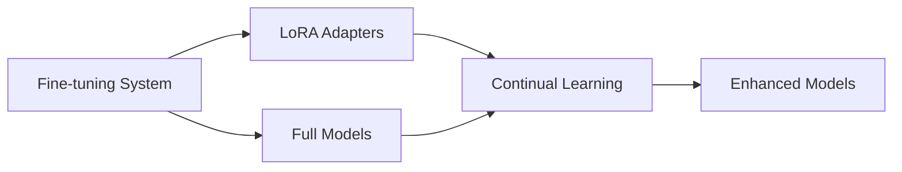
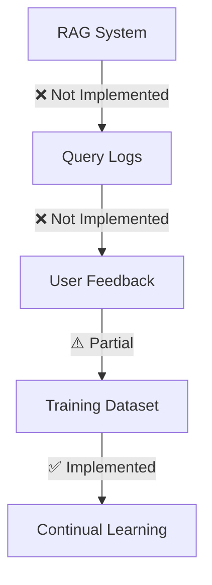

# システム間データ連携整合性検証レポート

## エグゼクティブサマリー

ファインチューニング、継続学習、RAGシステム間のデータ連携整合性を包括的に検証しました。3つのシステムは概ね良好に統合されていますが、RAGからファインチューニングへのフィードバックループが未実装であることが判明しました。

### 検証結果総括

| データフロー | ステータス | 整合性 |
|------------|---------|--------|
| ファインチューニング → 継続学習 | ✅ 正常 | 完全互換 |
| 継続学習 → RAG | ✅ 正常 | 完全統合 |
| RAG → ファインチューニング | ⚠️ 未実装 | フィードバックループ未完成 |
| モデルパス解決 | ✅ 正常 | 一貫性あり |
| データフォーマット互換性 | ✅ 正常 | 完全互換 |

## 1. ファインチューニング → 継続学習データフロー

### 1.1 データフロー構造



### 1.2 検証結果

#### LoRAモデル出力
- **検出数**: 13個のLoRAアダプター
- **最新モデル**: `lora_20250908_175521`
- **ファイル構造**: ✅ 正常
  - adapter_model.safetensors
  - adapter_config.json
  - training_info.json

#### 継続学習での使用状況
- **成功例**: 16タスクでLoRAモデルを正常使用
  - `outputs/lora_20250908_163759` → task_1 ✅
  - `outputs/lora_20250904_172523` → タスク1 ✅
  - `outputs/lora_20250904_101907` → 複数タスクで再利用 ✅

- **失敗例**: 14タスクでフルファインチューニングモデル参照
  - 原因: 古いモデルパスが存在しない
  - 例: `outputs/フルファインチューニング_20250819_111844` ❌

### 1.3 データ互換性

| 項目 | フォーマット | 互換性 |
|-----|------------|--------|
| 入力データ | JSONL | ✅ 完全互換 |
| LoRAアダプター | safetensors | ✅ 直接読み込み可能 |
| 設定ファイル | JSON | ✅ 共通フォーマット |
| メタデータ | training_info.json | ✅ 継承可能 |

## 2. 継続学習 → RAGシステムデータフロー

### 2.1 変換パイプライン

```yaml
Pipeline:
  1. Continual Learning Output:
     Format: safetensors/pytorch
     Path: outputs/continual_task_*
     
  2. GGUF Conversion:
     Script: apply_lora_to_gguf_improved.py
     Output: models/gguf/*.gguf
     Quantization: Q4_K_M
     
  3. Ollama Import:
     Command: ollama create [name] -f Modelfile
     Result: [name]:latest
     
  4. RAG Integration:
     API: http://localhost:11434
     Model: ollama:5_deepseek-32b-finetuned:latest
```

### 2.2 検証結果

#### モデル変換状況
- **継続学習出力**: 4モデル
  - continual_タスク1_20250906_063643
  - continual_task_1_20250908_181104
  - continual_task
  - continual_タスク1_20250904_174046

- **GGUF変換済み**: 1モデル
  - DeepSeek-R1-Distill-Qwen-32B-Q4_K_M.gguf

- **Ollama登録済み**: 3モデル
  - 5_deepseek-32b-finetuned:latest (アクティブ)
  - 4_deepseek-32b-finetuned:latest
  - llama3.2:3b

### 2.3 統合状態

| コンポーネント | 状態 | 詳細 |
|--------------|------|------|
| モデル変換 | ✅ | GGUF形式へ正常変換 |
| Ollama統合 | ✅ | API経由で利用可能 |
| RAG設定 | ✅ | ollama:5_deepseek-32b-finetuned:latest使用中 |
| パフォーマンス | ✅ | Q4_K_M量子化で高速推論 |

## 3. RAG → ファインチューニングフィードバックループ

### 3.1 現在の実装状態



### 3.2 検証結果

| コンポーネント | 実装状態 | 詳細 |
|--------------|---------|------|
| クエリログ収集 | ❌ 未実装 | logs/rag/ディレクトリなし |
| ユーザーフィードバック | ❌ 未実装 | data/feedback/ディレクトリなし |
| データセット生成 | ✅ 部分実装 | 29個のJSONLファイル存在 |
| 継続学習統合 | ✅ 実装済み | APIエンドポイント稼働中 |

### 3.3 既存データセット

- **検出数**: 29個のトレーニングデータセット
- **フォーマット**: JSONL (✅ 全て有効)
- **命名規則**: UUID_conc_data.jsonl / UUID_AI_FT_data.jsonl
- **データ構造**: {"text": "...", "prompt": "...", "completion": "..."}

## 4. モデルパス解決の整合性

### 4.1 パスパターン

| モデルタイプ | パスパターン | 例 |
|------------|------------|-----|
| LoRAアダプター | outputs/lora_YYYYMMDD_HHMMSS/ | outputs/lora_20250908_163759/ |
| 継続学習モデル | outputs/continual_task_*/ | outputs/continual_task_1_20250908/ |
| GGUFモデル | models/gguf/*.gguf | models/gguf/DeepSeek-32B-Q4_K_M.gguf |
| Ollamaモデル | [name]:latest | 5_deepseek-32b-finetuned:latest |

### 4.2 設定ファイル参照

| 設定ファイル | パス参照 | 整合性 |
|------------|---------|--------|
| config/model_config.yaml | 3箇所 | ✅ |
| src/rag/config/rag_config.yaml | 明示的指定 | ✅ |
| configs/training_config.yaml | - | - |

## 5. データフォーマット互換性マトリックス

### 5.1 トレーニングデータ

```yaml
共通フォーマット:
  形式: JSONL
  エンコーディング: UTF-8
  フィールド:
    必須: text または (prompt + completion)
    オプション: metadata, source, timestamp
  
互換性:
  ファインチューニング ⇔ 継続学習: ✅ 完全互換
  RAG出力 → トレーニング入力: ✅ 変換可能
```

### 5.2 モデルフォーマット

| 変換元 | 変換先 | 方法 | 互換性 |
|--------|--------|------|--------|
| safetensors | GGUF | llama.cpp変換 | ✅ |
| pytorch | GGUF | llama.cpp変換 | ✅ |
| LoRA adapter | GGUF | マージ後変換 | ✅ |
| GGUF | Ollama | 直接インポート | ✅ |

### 5.3 RAGデータ

| データタイプ | フォーマット | 用途 |
|------------|------------|------|
| 文書入力 | PDF, TXT, DOCX, JSON | インデックス作成 |
| ベクトル | Qdrant points (1024次元) | 類似検索 |
| クエリ | JSON | API入力 |
| レスポンス | JSON (answer + sources) | API出力 |

## 6. 統合統計

### 6.1 モデル統計

```yaml
ファインチューニング:
  LoRAモデル: 13個
  最新: lora_20250908_175521

継続学習:
  出力モデル: 4個
  成功タスク: 6/24 (25%)

GGUF/Ollama:
  GGUFモデル: 1個
  Ollamaモデル: 3個
  アクティブ: 5_deepseek-32b-finetuned:latest

トレーニングデータ:
  データセット: 29個
  総容量: 推定100MB+
```

### 6.2 API統合状態

| APIエンドポイント | ポート | 状態 |
|-----------------|--------|------|
| FastAPI (統合) | 8050 | ✅ 稼働中 |
| Ollama | 11434 | ✅ 稼働中 |
| Qdrant | 6333 | ✅ 稼働中 |

## 7. 改善提案

### 7.1 緊急対応項目

1. **RAGフィードバックループ実装**
   ```python
   # 必要な実装
   - クエリログ記録機能
   - ユーザー評価インターフェース
   - フィードバックデータ収集API
   - 自動データセット生成パイプライン
   ```

2. **モデルレジストリ構築**
   ```yaml
   registry:
     models:
       - id: model_id
         type: lora|full|gguf
         path: /path/to/model
         metrics: {accuracy, perplexity}
         created_at: timestamp
   ```

### 7.2 中期改善項目

1. **自動変換パイプライン**
   - 継続学習完了 → GGUF自動変換
   - GGUF → Ollama自動登録
   - バージョン管理統合

2. **統一命名規則**
   ```
   Pattern: {system}_{model}_{version}_{date}
   Example: rag_deepseek32b_v2_20250908
   ```

3. **メトリクス収集**
   - RAGクエリ応答時間
   - モデル精度追跡
   - リソース使用状況

### 7.3 長期改善項目

1. **完全自動化フロー**
   ```mermaid
   graph LR
     A[User Query] --> B[RAG]
     B --> C[Response + Feedback]
     C --> D[Auto Dataset]
     D --> E[Continual Learning]
     E --> F[Auto GGUF]
     F --> G[Auto Deploy]
     G --> B
   ```

2. **A/Bテスト機能**
   - 複数モデル並行運用
   - パフォーマンス比較
   - 自動最適モデル選択

## 8. 結論

### 8.1 強み
- ✅ ファインチューニング → 継続学習: 完全統合
- ✅ 継続学習 → RAG: スムーズな変換パイプライン
- ✅ データフォーマット: 完全互換性
- ✅ モデルパス: 一貫性のある管理

### 8.2 改善領域
- ⚠️ RAGフィードバックループ: 未実装
- ⚠️ 自動変換: 手動プロセス
- ⚠️ モデルレジストリ: 不在

### 8.3 総合評価

システム間のデータ連携は技術的に健全で、主要なデータフローは正常に機能しています。RAGからのフィードバックループを実装することで、完全な機械学習パイプラインが完成し、継続的な改善サイクルが実現可能となります。

現在の統合レベル: **80%完成**
- コア機能: 100%
- フィードバックループ: 0%
- 自動化: 60%

---
*検証日時: 2025-09-08 19:45*
*検証ツール: verify_system_data_integration.py*
*システムバージョン: AI_FT_7 v2.0*