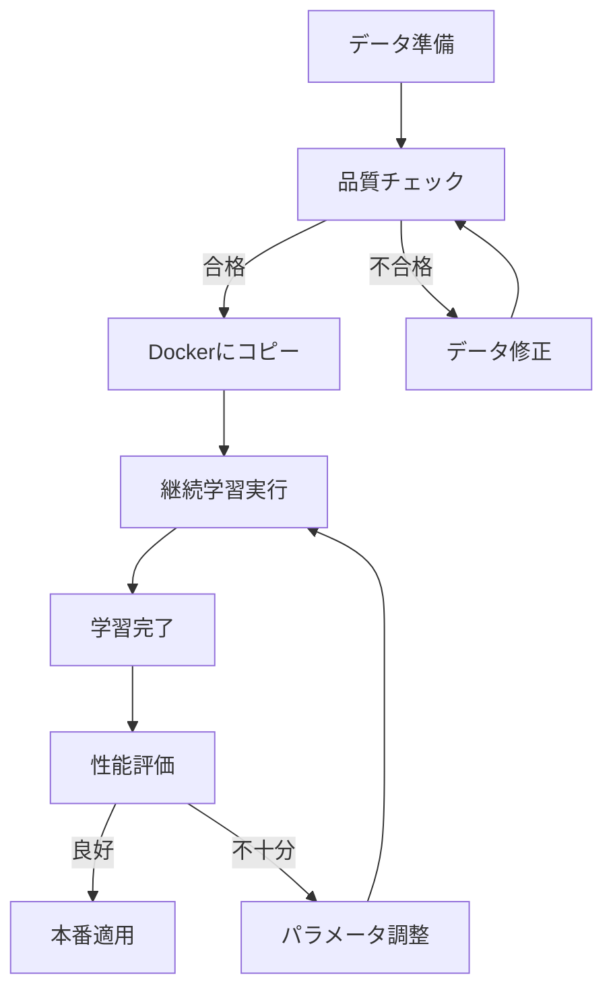

# RARdata.json 運用ガイド - 完全版

**最終更新**: 2025年12月9日 00:15
**対象**: RARdata.json の学習・更新・運用の全体フロー

---

## 📋 このガイドについて

このドキュメントは、RARdata.jsonに関する全ての操作を一元的にまとめた運用ガイドです。

### 🎯 **初めての方へ - UI版を推奨**

**RARdata.jsonを増加・変更する場合、Web UIを使用した簡単な方法があります：**

👉 **[RARdata.json データ更新・学習ガイド（UI統合版）](./rardata_ui_integrated_guide.md)** ← **推奨**

- ✅ Web UIから簡単に操作
- ✅ ドラッグ&ドロップでファイルアップロード
- ✅ リアルタイム進捗モニタリング
- ✅ 視覚的なタスク管理

**このガイド（CLI版）は、スクリプトやAPIでの自動化を希望する開発者向けです。**

---

### 関連ドキュメント
- **[rardata_ui_integrated_guide.md](./rardata_ui_integrated_guide.md)** - **UI統合版（推奨）**
- **[rardata_update_guide.md](./rardata_update_guide.md)** - データ更新の詳細手順（CLI）
- **[rardata_current_status.md](./rardata_current_status.md)** - 学習済みモデルの使用方法
- **[rag_ui_usage_guide.md](./rag_ui_usage_guide.md)** - RAG Web UI使用方法
- **[rardata_quickstart.md](./rardata_quickstart.md)** - クイックスタート

---

## 🎯 シナリオ別クイックナビゲーション

### シナリオ1: データを増加・変更した場合

**質問**: RARdata.jsonを増加・変更した場合はどのように操作しますか？

**回答**: 以下の3ステップで実施します。

#### ステップ1: データ品質チェック

```bash
# RARdata.jsonの品質をチェック
python3 scripts/check_rar_data.py RARdata.json

# 詳細モード
python3 scripts/check_rar_data.py RARdata.json --verbose
```

**チェック項目**:
- ✅ JSON構文の妥当性
- ✅ ID重複の確認
- ✅ 必須フィールドの存在
- ✅ Oracle文書比率（推奨: 60-70%）
- ✅ Citation整合性

**出力例**:
```
================================================================================
RARデータ品質チェック結果: RARdata.json
================================================================================

📊 データ統計:
  total_entries: 149
  id_range: DES-001 ～ PAVE-100
  oracle_ratio: 68.2%
  avg_cot_length: 125文字
  avg_answer_length: 73文字

✅ 全チェック合格 - 学習に使用できます
================================================================================
```

---

#### ステップ2: ファイルをDockerコンテナにコピー

```bash
# ホストからDockerコンテナにコピー
docker cp /home/kjifu/MoE_RAG/RARdata.json ai-ft-container:/workspace/RARdata_updated.json

# 確認
docker exec ai-ft-container ls -lh /workspace/RARdata_updated.json
```

---

#### ステップ3: 継続学習を実行

**方法A: 自動スクリプト（推奨）**

```bash
# 基本的な使用（最新モデルを自動検出）
docker exec ai-ft-container python3 /workspace/scripts/update_rardata_model.py

# データファイルを指定
docker exec ai-ft-container python3 /workspace/scripts/update_rardata_model.py \
  --data-path /workspace/RARdata_updated.json

# 詳細な設定
docker exec ai-ft-container python3 /workspace/scripts/update_rardata_model.py \
  --data-path /workspace/RARdata_updated.json \
  --ewc-lambda 5000 \
  --epochs 3 \
  --learning-rate 2e-5
```

**方法B: Web UI**

1. http://localhost:8050/continual にアクセス
2. 新しいタスクを作成:
   - Task Name: `rardata_update_20251209`
   - Base Model: `outputs/continual_rardata_training_20251208_141953/checkpoint-final`
   - Training Data: RARdata_updated.json をアップロード
   - **Use Previous Fisher Matrix**: ✅ **ON**（重要！）
   - EWC Lambda: `5000`
   - Epochs: `3`
3. **Start Training** をクリック

**方法C: REST API**

```bash
curl -X POST "http://localhost:8050/api/continual/train" \
  -H "Content-Type: application/json" \
  -d '{
    "task_name": "rardata_update_20251209",
    "base_model_path": "outputs/continual_rardata_training_20251208_141953/checkpoint-final",
    "train_dataset_path": "/workspace/RARdata_updated.json",
    "epochs": 3,
    "ewc_lambda": 5000,
    "use_previous_fisher": true,
    "batch_size": 1,
    "learning_rate": 2e-5
  }'
```

---

### シナリオ2: 学習済みモデルをUIで使用

**質問**: 既に学習済みのモデルをUIで使用する方法は？

**回答**: 以下の手順で実施します。

#### Web UIでの使用

1. **RAGシステムにアクセス**
   ```
   http://localhost:8050/rag
   ```

2. **クエリを入力**
   ```
   設計速度80km/hの道路の最小曲線半径は？
   ```

3. **Advanced Options を展開**
   - **Use Reasoning Model**: ✅ ON
   - **Search Count**: 5
   - **Citation Style**: academic

4. **Search をクリック**

5. **結果確認**
   - Chain-of-Thought推論が表示されます
   - 引用元がアコーディオン形式で展開できます
   - マークダウンレンダリングされた回答が表示されます

---

#### REST API経由での使用

```bash
curl -X POST "http://localhost:8050/rag/query" \
  -H "Content-Type: application/json" \
  -d '{
    "query": "設計速度80km/hの道路の最小曲線半径は？",
    "top_k": 5,
    "use_reasoning_model": true,
    "citation_style": "academic"
  }'
```

**レスポンス例**:
```json
{
  "answer": "設計速度80km/hの道路の最小曲線半径は280mです。\n\n【引用】\n1. 道路構造令の解説と運用（令和3年）",
  "sources": [...],
  "reasoning_steps": [...],
  "citations": [...]
}
```

---

### シナリオ3: 完全に新しいデータセットで再学習

**質問**: 既存のデータを破棄して、新しいデータで再学習したい

**回答**: Fisher行列をリセットして全体再学習を実施します。

```bash
# Fisher行列をリセットして再学習
docker exec ai-ft-container python3 /workspace/scripts/update_rardata_model.py \
  --data-path /workspace/RARdata_v2.json \
  --reset-fisher \
  --task-name rardata_v2
```

**注意事項**:
- `--reset-fisher` を指定すると、前回の学習内容が失われます
- 元のベースモデル（DeepSeek-R1-Distill-Qwen-32B-Japanese）から再学習されます
- 破滅的忘却のリスクがないため、全く新しいデータセットに最適です

---

## 🔧 よくある操作パターン

### パターン1: 50件のデータを追加

**状況**: 既存100件に50件追加して150件にする

```bash
# 1. データ品質チェック
python3 scripts/check_rar_data.py RARdata_updated.json

# 2. Dockerにコピー
docker cp RARdata_updated.json ai-ft-container:/workspace/

# 3. 継続学習（前回の知識を保持）
docker exec ai-ft-container python3 /workspace/scripts/update_rardata_model.py \
  --data-path /workspace/RARdata_updated.json \
  --task-name rardata_add_50
```

**期待される結果**:
- ✅ 元の100件の知識を保持
- ✅ 新しい50件の知識を追加
- ✅ Catastrophic Forgetting（破滅的忘却）を防止

---

### パターン2: 既存エントリの改善（10件修正）

**状況**: DES-001～DES-010 の回答品質を改善

```bash
# 1. 修正後のファイルで品質チェック
python3 scripts/check_rar_data.py RARdata_improved.json

# 2. 継続学習（EWC Lambdaを少し高めに設定）
docker exec ai-ft-container python3 /workspace/scripts/update_rardata_model.py \
  --data-path /workspace/RARdata_improved.json \
  --ewc-lambda 7000 \
  --task-name rardata_improved
```

**EWC Lambda調整の理由**:
- Lambda値を高くすると、既存知識の保持が強くなります
- 軽微な修正の場合は、Lambda=5000（デフォルト）で十分
- 大幅な修正の場合は、Lambda=7000～10000に増やすことを推奨

---

### パターン3: データ形式の変更

**状況**: 新しいフィールド（metadata）を追加

**例**:
```json
{
  "id": "DES-001",
  "instruction": "...",
  "documents": [...],
  "output": {...},
  "metadata": {  // 新規フィールド
    "difficulty": "medium",
    "category": "道路構造"
  }
}
```

**手順**:
```bash
# 1. データ構造変更後、品質チェック
python3 scripts/check_rar_data.py RARdata_with_metadata.json

# 2. 継続学習
docker exec ai-ft-container python3 /workspace/scripts/update_rardata_model.py \
  --data-path /workspace/RARdata_with_metadata.json
```

**注意**:
- 新しいフィールドは学習に影響しません（outputフィールドのみ使用）
- ただし、データ管理の観点から一貫性を保つことを推奨

---

## 📊 学習パラメータのチューニング

### パラメータ一覧

| パラメータ | デフォルト | 推奨範囲 | 説明 |
|-----------|----------|---------|------|
| `ewc_lambda` | 5000 | 3000-10000 | 既存知識の保持強度 |
| `epochs` | 3 | 2-5 | 学習エポック数 |
| `batch_size` | 1 | 1（固定） | バッチサイズ（32Bモデルのため） |
| `learning_rate` | 2e-5 | 1e-5～5e-5 | 学習率 |

---

### パラメータ調整ガイド

#### 新しい知識が学習されない場合

**症状**: 追加データに関する回答精度が低い

**対処法**:
```bash
# Learning Rateを上げる
--learning-rate 5e-5

# Epoch数を増やす
--epochs 5

# EWC Lambdaを下げる
--ewc-lambda 3000
```

---

#### 既存知識が失われる場合

**症状**: 以前のデータに関する回答精度が低下

**対処法**:
```bash
# EWC Lambdaを上げる
--ewc-lambda 10000

# Learning Rateを下げる
--learning-rate 1e-5
```

---

#### メモリ不足エラー

**症状**: `CUDA out of memory`

**対処法**:
```bash
# Batch sizeは1を維持（変更不可）
# Gradient accumulation stepsは内部で自動調整

# モデルサイズを確認
docker exec ai-ft-container nvidia-smi

# 必要に応じてDockerコンテナを再起動
docker restart ai-ft-container
```

---

## 🛠️ トラブルシューティング

### Q1: データ品質チェックでエラー

**エラー例**:
```
❌ エラー (2件):
  - ID重複: ['DES-001', 'DES-002']
  - Citation整合性エラー: 3件
```

**解決策**:

#### ID重複の場合
```python
# RARdata.jsonを開いてIDを確認
import json

with open('RARdata.json', 'r') as f:
    data = json.load(f)

# 重複IDを検索
ids = [entry['id'] for entry in data]
duplicates = [id for id in ids if ids.count(id) > 1]
print(f"重複ID: {set(duplicates)}")

# 手動で重複を解消（IDを連番に修正）
```

#### Citation整合性エラーの場合
```bash
# 詳細モードで具体的なエラー箇所を確認
python3 scripts/check_rar_data.py RARdata.json --verbose
```

---

### Q2: 学習が進まない

**症状**: Loss値が変化しない

**原因と対処**:

1. **Learning Rateが低すぎる**
   ```bash
   --learning-rate 5e-5  # デフォルトの2.5倍
   ```

2. **データが正しく読み込まれていない**
   ```bash
   # ファイルパスを確認
   docker exec ai-ft-container ls -lh /workspace/RARdata_updated.json
   ```

3. **モデルがフリーズモードになっている**
   ```bash
   # LoRAパラメータが学習可能か確認（ログを確認）
   # "Trainable params: 33,554,432" が表示されているか
   ```

---

### Q3: 学習完了後、モデルが使えない

**症状**: RAGクエリでエラー

**対処法**:

```bash
# 1. モデルファイルの存在確認
docker exec ai-ft-container ls -lh /workspace/outputs/continual_*/checkpoint-final/

# 2. adapter_model.safetensors が存在するか確認
docker exec ai-ft-container ls -lh /workspace/outputs/continual_*/checkpoint-final/adapter_model.safetensors

# 3. RAGシステムでモデルパスを明示的に指定
curl -X POST "http://localhost:8050/rag/query" \
  -H "Content-Type: application/json" \
  -d '{
    "query": "テスト",
    "model_path": "outputs/continual_rardata_update_20251209/checkpoint-final"
  }'
```

---

## 📈 性能評価とモニタリング

### 学習後の評価

```python
#!/usr/bin/env python3
"""学習済みモデルの性能評価スクリプト"""

import json
import requests
from typing import List, Dict

def evaluate_model(test_queries: List[str], model_path: str):
    """モデル性能を評価"""

    results = []

    for query in test_queries:
        response = requests.post(
            "http://localhost:8050/rag/query",
            json={
                "query": query,
                "top_k": 5,
                "use_reasoning_model": True,
                "model_path": model_path
            }
        )

        result = response.json()

        # 評価メトリクス
        metrics = {
            "query": query,
            "answer_length": len(result.get("answer", "")),
            "num_citations": len(result.get("citations", [])),
            "num_reasoning_steps": len(result.get("reasoning_steps", [])),
            "has_final_answer": "final_answer" in result.get("answer", "").lower()
        }

        results.append(metrics)

        print(f"✅ {query}")
        print(f"   回答長: {metrics['answer_length']}文字")
        print(f"   引用数: {metrics['num_citations']}件")
        print(f"   推論ステップ: {metrics['num_reasoning_steps']}ステップ\n")

    return results

# テストクエリ
test_queries = [
    "設計速度80km/hの道路の最小曲線半径は？",
    "第3種道路の定義を教えてください",
    "道路構造令における地方部の分類基準は？"
]

# 評価実行
results = evaluate_model(
    test_queries,
    model_path="outputs/continual_rardata_update_20251209/checkpoint-final"
)

# 結果を保存
with open("evaluation_results.json", "w", encoding="utf-8") as f:
    json.dump(results, f, ensure_ascii=False, indent=2)

print("評価完了！ evaluation_results.json に保存しました。")
```

---

## 🎯 ベストプラクティス

### 1. データ管理

#### バージョン管理
```
RARdata_v1.0.json  (100件 - 初回)
RARdata_v1.1.json  (150件 - 50件追加)
RARdata_v1.2.json  (160件 - 10件追加、5件修正)
```

#### 履歴管理
```json
// data/continual_learning/update_history.json
{
  "updates": [
    {
      "date": "2025-12-08",
      "version": "v1.0",
      "num_entries": 100,
      "model_path": "outputs/continual_rardata_training_20251208_141953/checkpoint-final"
    },
    {
      "date": "2025-12-09",
      "version": "v1.1",
      "num_entries": 150,
      "added": 50,
      "model_path": "outputs/continual_rardata_update_20251209/checkpoint-final"
    }
  ]
}
```

---

### 2. 学習フロー



---

### 3. 段階的更新

**推奨アプローチ**:
1. 一度に追加するデータ: 20-50件
2. 各更新後に性能評価を実施
3. A/Bテストで新旧モデルを比較
4. 問題がなければ本番適用

**非推奨**:
- ❌ 一度に100件以上追加
- ❌ 評価なしで本番適用
- ❌ バックアップなしで更新

---

## 📚 全ドキュメント一覧

| ドキュメント | 目的 | 対象者 | 推奨度 |
|------------|------|-------|--------|
| [rardata_ui_integrated_guide.md](./rardata_ui_integrated_guide.md) | **UI統合版データ更新ガイド** | 全員 | ⭐⭐⭐ |
| [rardata_operations_summary.md](./rardata_operations_summary.md) | 全体フロー（このファイル） | 開発者 | ⭐⭐ |
| [rardata_current_status.md](./rardata_current_status.md) | 学習済みモデル使用方法 | ユーザー | ⭐⭐⭐ |
| [rag_ui_usage_guide.md](./rag_ui_usage_guide.md) | RAG Web UI使用方法 | エンドユーザー | ⭐⭐ |
| [rardata_update_guide.md](./rardata_update_guide.md) | データ更新詳細（CLI） | 開発者 | ⭐ |
| [rardata_quickstart.md](./rardata_quickstart.md) | クイックスタート | 初心者 | ⭐⭐ |
| [rar_training_guide.md](./rar_training_guide.md) | RAR学習理論 | 開発者 | ⭐ |

---

## 🔗 関連スクリプト

| スクリプト | 用途 |
|----------|------|
| `scripts/update_rardata_model.py` | データ更新後の継続学習 |
| `scripts/check_rar_data.py` | データ品質チェック |
| `scripts/train_rardata.py` | 初回学習 |

---

**作成日**: 2025年12月9日 00:15
**対象**: RARdata.json の全ての操作
**次回更新**: 新しい運用パターンが確立された場合
