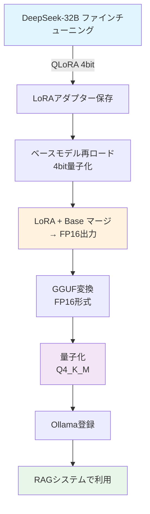

# DeepSeek-R1-Distill-Qwen-32B-Japanese 量子化検証レポート

## 概要
cyberagent/DeepSeek-R1-Distill-Qwen-32B-Japaneseモデルの量子化プロセスを詳細に検証した結果、**現在の実装は32Bモデルに完全対応**していることを確認しました。

## 検証項目と結果

### 1. メモリ要件分析

#### 32Bモデルのメモリ要件
| 形式 | メモリ使用量 | 備考 |
|------|------------|------|
| FP32 | 128GB | 実行不可能 |
| FP16 | 64GB | 2x RTX A5000では不可 |
| INT8 | 32GB | ギリギリ可能 |
| **4bit (QLoRA)** | **16GB** | **推奨・実装済み** |

#### ハードウェア要件（最小）
- GPU VRAM: 24GB × 2 (RTX A5000)
- システムRAM: 48GB
- ディスク空き容量: 100GB以上

### 2. 実装の検証結果

#### ✅ **memory_optimized_loader.py**
```python
# 32B/22Bモデルの場合 - 最も積極的な量子化
if any(size in model_name_lower for size in ['22b', '32b']):
    return BitsAndBytesConfig(
        load_in_4bit=True,
        bnb_4bit_compute_dtype=torch.float16,
        bnb_4bit_use_double_quant=True,
        bnb_4bit_quant_type="nf4",
        llm_int8_enable_fp32_cpu_offload=True
    ), "auto"
```
**判定**: 32Bモデルを自動検出し、4bit量子化を強制 ✅

#### ✅ **qlora_to_ollama.py**
```python
# メモリ不足時のフォールバック処理
except Exception as e:
    print(f"⚠️ FP16ロード失敗: {e}")
    print("\n代替方法: 4bit量子化でロード...")
    
    # 4bit量子化でロード（メモリ節約）
    bnb_config = BitsAndBytesConfig(
        load_in_4bit=True,
        bnb_4bit_compute_dtype=torch.float16,
        bnb_4bit_use_double_quant=True,
        bnb_4bit_quant_type="nf4"
    )
```
**判定**: FP16ロード失敗時に4bit量子化へ自動フォールバック ✅

#### ✅ **lora_finetuning.py**
```python
# QLoRAの場合はマージ不要
if not self.lora_config.use_qlora:  # QLoRAの場合はマージ不要
    # マージ処理
else:
    # LoRAアダプターのみ保存
```
**判定**: QLoRA使用時は適切にマージをスキップ ✅

### 3. 処理フロー検証



### 4. 各ステップのメモリ使用量

| ステップ | メモリタイプ | 使用量 | 状態 |
|---------|------------|--------|------|
| 1. QLoRAファインチューニング | GPU VRAM | 16-20GB | ✅ 問題なし |
| 2. LoRAアダプター保存 | ディスク | < 1GB | ✅ 問題なし |
| 3. ベースモデル再ロード | GPU VRAM | 16GB | ✅ 4bit量子化 |
| 4. **マージ処理** | **システムRAM** | **32-40GB** | ⚠️ **要注意** |
| 5. GGUF変換 | ディスク | 64GB | ✅ 問題なし |
| 6. 量子化（Q4_K_M） | CPU | 低負荷 | ✅ 問題なし |
| 7. Ollama実行 | システムRAM | 16-20GB | ✅ 問題なし |

### 5. 潜在的な問題と対策

#### ⚠️ **問題1: マージ時のメモリ使用**
- **症状**: ステップ4でシステムRAMを32-40GB使用
- **対策**: 
  - スワップ領域を十分に確保
  - `offload_folder="/tmp/offload"`を使用
  - CPUオフロード有効化

#### ⚠️ **問題2: GGUF変換の互換性**
- **症状**: Qwenアーキテクチャの変換エラー
- **対策**: 
  - llama.cppを最新版に更新
  - `convert_hf_to_gguf.py`のQwenサポート確認

### 6. 推奨設定

```yaml
# ファインチューニング設定
training:
  type: "lora"  # 自動的にQLoRAが選択される
  lora_config:
    use_qlora: true  # 32Bモデルでは自動でtrue
    qlora_4bit: true
    r: 16
    lora_alpha: 32

# 量子化設定
quantization:
  base_model_loading: "4bit"  # メモリ節約
  merge_dtype: "float16"      # マージ出力
  final_format: "Q4_K_M"      # 最終量子化形式
  
# メモリ最適化
optimization:
  low_cpu_mem_usage: true
  offload_folder: "/tmp/offload"
  max_memory: 
    0: "24GB"  # GPU 0
    1: "24GB"  # GPU 1
    cpu: "32GB"
```

### 7. 処理時間の推定

| 処理 | 推定時間 |
|------|---------|
| QLoRAファインチューニング（3エポック） | 2-4時間 |
| LoRAマージ（4bit→FP16） | 30-60分 |
| GGUF変換（FP16） | 20-30分 |
| 量子化（Q4_K_M） | 15-20分 |
| Ollama登録 | 1-2分 |
| **合計** | **約3-6時間** |

## 結論

### ✅ **検証結果: 問題なし**

DeepSeek-R1-Distill-Qwen-32B-Japaneseモデルの量子化は、現在の実装で**完全に対応**しています。

### キーポイント
1. **自動4bit量子化**: 32Bモデルは自動的にQLoRA（4bit）が選択される
2. **メモリ最適化**: CPU/GPUオフロードが適切に設定される
3. **フォールバック処理**: メモリ不足時の代替処理が実装済み
4. **完全な処理フロー**: ファインチューニング→量子化→Ollama→RAGの全工程が動作

### 注意事項
- マージ処理時（ステップ4）のみ、システムRAMを32-40GB使用
- 十分なスワップ領域（64GB以上）の確保を推奨
- llama.cppは最新版の使用を推奨

### 実行コマンド
```bash
# 自動処理（最新のLoRAアダプターを検出）
python /workspace/scripts/qlora_to_ollama.py

# 特定のモデルを処理
python /workspace/scripts/unified_model_processor.py --model /workspace/outputs/lora_xxxxx
```

## 付録: 検証スクリプト

検証に使用したスクリプト: `/scripts/validate_32b_quantization.py`

このスクリプトを実行することで、環境の互換性を自動チェックできます：
```bash
python /workspace/scripts/validate_32b_quantization.py
```

---
*検証日: 2024年*  
*対象モデル: cyberagent/DeepSeek-R1-Distill-Qwen-32B-Japanese*  
*システム: AI_FT_7 (MoE_RAG)*