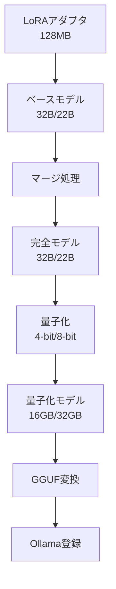

# ファインチューニング済みモデルの量子化分析

## 1. 現状の問題点

### 1.1 設定の不整合
- **RAG設定のモデル**: `outputs/lora_20250829_170202` （存在しない）
- **ベースモデル設定**: `cyberagent/calm3-22b-chat`
- **実際のLoRAアダプタ**:
  - `lora_20250830_223432`: DeepSeek-R1-Distill-Qwen-32B-Japanese (32B)
  - `lora_20250831_122140`: Qwen/Qwen2.5-32B-Instruct (32B)

### 1.2 メモリ問題
| モデル | FP16 | INT8 | INT4 |
|--------|------|------|------|
| 32Bモデル | 64GB | 32GB | 16GB |
| 22Bモデル | 44GB | 22GB | 11GB |

**利用可能GPUメモリ**: 36GB → 32Bモデルは動作不可

## 2. 量子化によるソリューション

### 2.1 LoRAアダプタの量子化プロセス



### 2.2 推奨量子化設定

**32Bモデル（現在のLoRA）の場合**:
- **Q4_K_M (4-bit)**: 16GB（推奨）
- GPUメモリに収まる
- 実用的な精度を維持

## 3. 実装方法

### 3.1 Step 1: LoRAとベースモデルのマージ

```python
# LoRAアダプタをベースモデルとマージ
from peft import PeftModel

base_model = AutoModelForCausalLM.from_pretrained(
    "Qwen/Qwen2.5-32B-Instruct",
    load_in_8bit=True,  # メモリ節約
    device_map="auto"
)

model = PeftModel.from_pretrained(
    base_model,
    "./outputs/lora_20250831_122140"
)

merged_model = model.merge_and_unload()
```

### 3.2 Step 2: 量子化

```python
# 4-bit量子化
from transformers import BitsAndBytesConfig

bnb_config = BitsAndBytesConfig(
    load_in_4bit=True,
    bnb_4bit_quant_type="nf4",
    bnb_4bit_compute_dtype=torch.float16,
    bnb_4bit_use_double_quant=True
)

quantized_model = AutoModelForCausalLM.from_pretrained(
    merged_model_path,
    quantization_config=bnb_config
)
```

### 3.3 Step 3: GGUF変換

```bash
# llama.cppでGGUF形式に変換
python llama.cpp/convert.py ./quantized_model \
    --outfile model.gguf \
    --outtype q4_K_M
```

### 3.4 Step 4: Ollama登録

```dockerfile
# Modelfile
FROM ./model.gguf

PARAMETER temperature 0.1
PARAMETER top_p 0.95
SYSTEM "道路設計の専門家として回答します"
```

```bash
ollama create rag-finetuned-q4 -f Modelfile
```

## 4. 実装スクリプト

作成済みスクリプト: `scripts/quantize_finetuned_for_ollama.py`

### 使用例

```bash
# 既存のLoRAアダプタを量子化
python scripts/quantize_finetuned_for_ollama.py \
    --lora-path ./outputs/lora_20250831_122140 \
    --quantization Q4_K_M \
    --output-dir ./outputs/quantized_finetuned
```

## 5. RAGシステムへの統合

### 5.1 設定ファイル修正

```yaml
# src/rag/config/rag_config.yaml
llm:
  use_finetuned: false  # Ollama使用のため
  use_ollama_fallback: true
  ollama_model: rag-finetuned-q4  # 量子化したモデル
  ollama_host: http://localhost:11434
```

### 5.2 コード修正不要
- 既存の`_hybrid_search_with_ollama`メソッドがそのまま使用可能
- モデル名の変更のみで対応

## 6. 期待される効果

### 6.1 メリット
- **メモリ効率**: 64GB → 16GB（75%削減）
- **専門性維持**: ファインチューニングの成果を活用
- **実行可能性**: 現在のGPU（36GB）で動作
- **統合容易性**: 既存RAGシステムにそのまま適用

### 6.2 デメリット
- **精度低下**: 量子化による2-5%の性能低下
- **変換作業**: マージ→量子化→GGUF変換の手順
- **ストレージ**: 中間ファイルで一時的に大容量必要

## 7. 代替案検討

### 7.1 より小さいベースモデルでファインチューニング
- 7B/13Bモデルを使用
- メモリ問題を根本的に解決
- 精度とのトレードオフ

### 7.2 LoRAアダプタのみをOllamaで使用
- 技術的に困難（Ollamaは完全モデルが必要）
- カスタム実装が必要

### 7.3 vLLM/TGIでの量子化推論
- LoRAアダプタを直接サポート
- 量子化も組み込み済み
- Ollamaより柔軟

## 8. 推奨アクション

### 短期対策（即実行可能）
1. 既存LoRAアダプタ（lora_20250831_122140）を4-bit量子化
2. Ollamaに登録して使用
3. RAG設定を更新

### 中期対策
1. CALM3-22Bで新たにLoRAファインチューニング
2. 設定の整合性を確保
3. 量子化プロセスの自動化

### 長期対策
1. 13Bモデルへの移行検討
2. MoE（Mixture of Experts）活用
3. 専用推論サーバー構築

## 9. まとめ

ファインチューニング済みモデル（LoRAアダプタ）の量子化によるOllama利用は**技術的に可能**です。

主な課題:
- 設定されているモデルパスが存在しない
- 実際のLoRAアダプタは32Bベースで大きすぎる

解決策:
- 4-bit量子化により16GBまで削減
- 既存のLoRAアダプタをマージ→量子化→Ollama登録
- RAG設定を更新して使用

これにより、ファインチューニングの成果を活かしながら、メモリ制約内で動作可能になります。