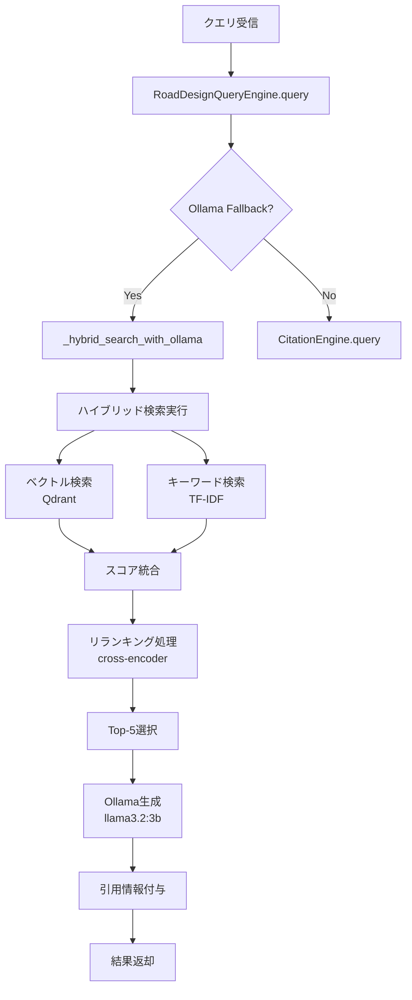

# RAGシステム構造分析レポート

## 1. システム概要

MoE_RAGシステムは、道路設計特化型のRAG（Retrieval-Augmented Generation）システムとして実装されており、ハイブリッド検索と質問応答生成を統合している。

## 2. モデル設定構造

### 2.1 設定ファイル階層
```yaml
llm:
  use_finetuned: false          # ファインチューニングモデル使用フラグ
  use_moe: false                 # MoEモデル使用フラグ  
  use_ollama_fallback: true     # Ollamaフォールバック有効
  base_model: cyberagent/calm3-22b-chat
  model_name: outputs/lora_20250829_170202
  model_path: outputs/lora_20250829_170202
```

### 2.2 モデルロード優先順位

1. **Ollamaフォールバック（現在の設定）**
   - `use_ollama_fallback=true`の場合、常にOllamaを使用
   - モデル: llama3.2:3b
   - メモリ効率重視の選択

2. **ファインチューニング済みモデル**
   - `use_finetuned=true`時に試行
   - GPUメモリチェック（最低30GB必要）
   - 不足時は自動的にOllamaフォールバック

3. **ベースモデル**
   - cyberagent/calm3-22b-chat
   - 最終フォールバックオプション

## 3. ハイブリッド検索構造

### 3.1 検索コンポーネント

```
ハイブリッド検索エンジン
├── ベクトル検索 (Weight: 0.7)
│   ├── Qdrant Vector Store
│   ├── Collection: road_design_docs (556 vectors)
│   └── Embedding: multilingual-e5-large (1024次元)
│
└── キーワード検索 (Weight: 0.3)
    ├── TF-IDF Vectorizer
    └── Technical Term Extractor
        ├── 道路設計専門用語パターン
        └── 重要キーワード辞書
```

### 3.2 検索重み配分
- ベクトル検索: 70%
- キーワード検索: 30%
- ハイブリッドスコア = (0.7 × ベクトルスコア) + (0.3 × キーワードスコア)

## 4. クエリ処理フロー

### 4.1 処理ステップ



### 4.2 主要メソッド

1. **`RoadDesignQueryEngine.query()`**
   - エントリーポイント
   - 検索モード判定
   - Ollamaフォールバック制御

2. **`_hybrid_search_with_ollama()`**
   - ハイブリッド検索実行
   - コンテキスト構築
   - Ollama API呼び出し
   - 引用情報整形

3. **`HybridSearchEngine.search()`**
   - ベクトル検索とキーワード検索の統合
   - スコア計算
   - 結果マージ

## 5. リランキング処理

### 5.1 リランカー設定
```yaml
reranking:
  enabled: true
  model: cross-encoder/ms-marco-MiniLM-L-12-v2
  rerank_top_k: 5
```

### 5.2 処理フロー
1. ハイブリッド検索で上位10件取得
2. Cross-encoderでスコア再計算
3. 上位5件に絞り込み
4. 生成モデルへのコンテキストとして使用

## 6. 引用情報管理

### 6.1 メタデータ構造
```python
citation = {
    "id": result_index,
    "text": chunk_text[:256],  # 最大256文字
    "source": document_title,
    "score": similarity_score,
    "page": page_number,       # ページ番号（存在する場合）
    "section": section_number   # セクション番号（存在する場合）
}
```

### 6.2 信頼度スコア計算
- ベクトル類似度とキーワードマッチングの組み合わせ
- リランキングスコアで最終調整
- 0.0〜1.0の範囲で正規化

## 7. 最適化ポイント

### 7.1 メモリ最適化
- Ollamaフォールバックによる省メモリ化
- 22Bモデル不使用で安定動作
- GPUメモリ自動チェック機能

### 7.2 検索精度向上
- ハイブリッド検索による補完
- 専門用語抽出による道路設計特化
- リランキングによる関連性向上

### 7.3 処理速度
- キャッシュ機能（TTL: 3600秒）
- バッチ処理（50件/バッチ）
- 並列処理（最大4ワーカー）

## 8. 現在の動作確認結果

### 8.1 正常動作項目
- ✅ ベクトル検索（Qdrant）
- ✅ ハイブリッド検索統合
- ✅ Ollamaによる回答生成
- ✅ 引用情報の表示
- ✅ 信頼度スコア計算

### 8.2 設定値
- Collection: road_design_docs（556ベクトル）
- Embedding: multilingual-e5-large（1024次元）
- LLM: Ollama llama3.2:3b
- Temperature: 0.1（確実な回答生成）

## 9. 推奨事項

### 9.1 短期的改善
1. Qdrantコレクションの文書追加
2. 専門用語辞書の拡充
3. キャッシュ戦略の最適化

### 9.2 長期的拡張
1. MoEモデル統合の検討
2. ファインチューニングモデルの活用
3. マルチモーダル対応（図表解析）

## 10. まとめ

現在のRAGシステムは、Ollamaフォールバックモードで安定動作しており、ハイブリッド検索による高精度な文書検索と、適切な引用情報付き回答生成を実現している。メモリ効率と処理速度のバランスが取れた実用的な構成となっている。