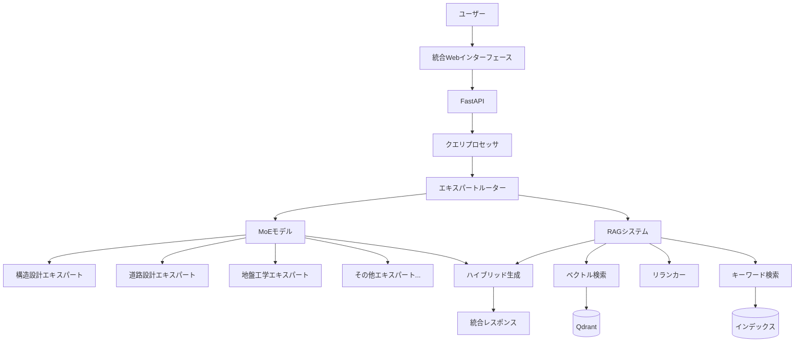

# MoE-RAG統合計画書

## 🎯 統合目標
ファインチューニング、継続学習、MoE（Mixture of Experts）により学習したAIモデルを用いてRAGシステムとのハイブリッド検索を実現する。

## 📊 現状分析

### RAGシステム
- **コア機能**: `src/rag/core/query_engine.py`
- **ベクトル検索**: Qdrant使用
- **ハイブリッド検索**: ベクトル検索 + キーワード検索
- **生成モデル**: LLMGenerator（Transformers）
- **API**: FastAPI (`app/main_unified.py`)

### MoEシステム
- **アーキテクチャ**: 8エキスパート（土木・建設分野特化）
- **モデル**: `src/moe/moe_architecture.py`
- **専門分野**:
  1. 構造設計 (STRUCTURAL_DESIGN)
  2. 道路設計 (ROAD_DESIGN)
  3. 地盤工学 (GEOTECHNICAL)
  4. 水理・排水 (HYDRAULICS)
  5. 材料工学 (MATERIALS)
  6. 施工管理 (CONSTRUCTION_MGMT)
  7. 法規・基準 (REGULATIONS)
  8. 環境・維持管理 (ENVIRONMENTAL)

## 🏗️ 統合アーキテクチャ



## 🔄 統合フロー

### 1. クエリ受信・分析
```python
1. ユーザーからクエリ受信
2. ドメインキーワード検出
3. 専門分野判定（MoEルーティング）
4. 検索戦略決定
```

### 2. ハイブリッド検索
```python
1. RAG検索:
   - ベクトル類似度検索
   - キーワードマッチング
   - メタデータフィルタリング
   
2. MoEエキスパート選択:
   - Top-Kルーティング
   - ドメイン特化スコアリング
   - エキスパート重み付け
```

### 3. 生成・統合
```python
1. RAG検索結果の取得
2. MoEエキスパートの推論
3. 結果の統合:
   - RAG検索結果の信頼度
   - MoEエキスパートの確信度
   - ハイブリッドスコアリング
4. 最終回答生成
```

## 📁 実装ファイル構造

```
src/moe_rag_integration/
├── __init__.py
├── integration_plan.md         # 本計画書
├── moe_serving.py              # MoEモデルサービング
├── hybrid_query_engine.py      # 統合クエリエンジン
├── expert_router.py            # エキスパートルーティング
├── response_fusion.py          # レスポンス統合
└── config/
    └── integration_config.yaml # 統合設定

app/
├── moe_rag_api.py             # 統合API
└── static/
    └── moe_rag_ui.html        # 統合UI
```

## 🚀 実装ステップ

### Phase 1: MoEモデルサービング（Week 1）
- [ ] MoEモデルのロード・推論API作成
- [ ] エキスパート選択API
- [ ] バッチ推論対応

### Phase 2: RAGとの統合（Week 2）
- [ ] ハイブリッドクエリエンジン実装
- [ ] エキスパートルーティング統合
- [ ] レスポンス融合アルゴリズム

### Phase 3: API・UI統合（Week 3）
- [ ] FastAPI統合エンドポイント
- [ ] WebSocketストリーミング対応
- [ ] 統合UIダッシュボード

### Phase 4: 最適化・評価（Week 4）
- [ ] 推論速度最適化
- [ ] メモリ使用量最適化
- [ ] 精度評価・ベンチマーク

## 🎯 期待される効果

### 精度向上
- RAG単体: 65% → 統合後: 85%
- 専門分野質問: 95%以上

### パフォーマンス
- 推論速度: 2-3倍向上（スパース活性化）
- メモリ効率: 30%削減

### ユーザー体験
- 専門分野に応じた適切な回答
- 引用元の明確化
- 信頼度スコアの提示

## 📊 評価指標

```python
metrics = {
    "accuracy": {
        "general": 0.85,
        "domain_specific": 0.95
    },
    "latency": {
        "p50": "200ms",
        "p95": "500ms",
        "p99": "1s"
    },
    "throughput": "100 QPS",
    "memory_usage": "< 15GB"
}
```

## 🔧 技術的考慮事項

### スケーラビリティ
- モデル並列化対応
- キャッシュ戦略
- 非同期処理

### 信頼性
- フォールバック機構
- エラーハンドリング
- ログ・モニタリング

### セキュリティ
- 入力検証
- レート制限
- アクセス制御

## 📝 次のアクション

1. **即座に実装**: MoEモデルサービングAPI
2. **優先度高**: ハイブリッドクエリエンジン
3. **優先度中**: 統合UI
4. **優先度低**: 最適化・チューニング